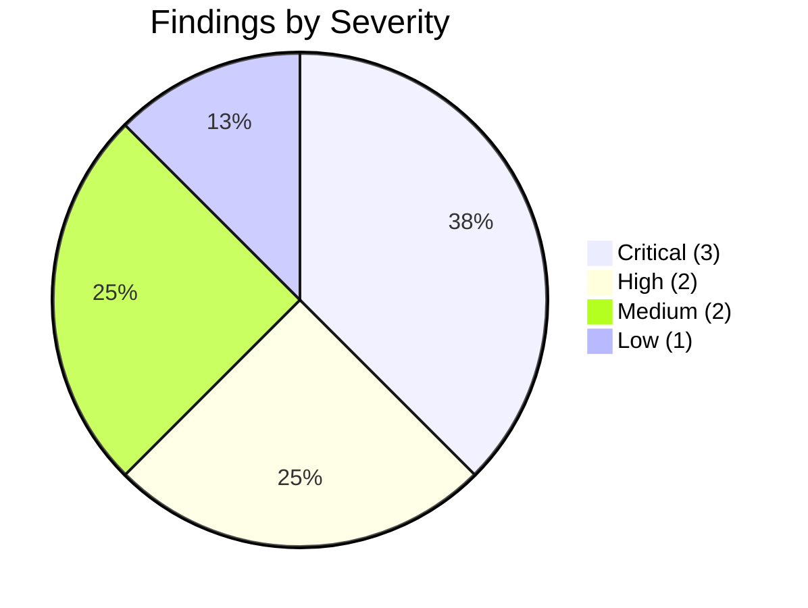

# Penetration Test Report — Executive Summary

<div align="center">

### Acme Corp — Internal Security Assessment

**Engagement:** Boiler CTF Host — Full Penetration Test\
**Classification:** 🔴 CONFIDENTIAL — Authorized Recipients Only

---

| Field | Detail |
|:---|:---|
| **Client** | Acme Corp |
| **Tester** | Ross Moravec |
| **Engagement Window** | Week of 2025-04-07 |
| **Report Date** | 2025-04-14 |
| **Scope** | Single host, all ports (1–65535), full pentest lifecycle |
| **Overall Risk Rating** | **CRITICAL** |

</div>

---

> [!CAUTION]
> This report is a **simulated engagement** produced for academic purposes as part of the Postgraduate Cybersecurity Certificate (CSC-7311) at Cambrian College, Winter 2025. The target is a deliberately vulnerable TryHackMe room — not a production system. The fictional client name "Acme Corp" is used solely to practise industry-standard reporting formats.

---

## Table of Contents

- [1. Executive Summary](#1-executive-summary)
- [2. Scope & Methodology](#2-scope--methodology)
- [3. Risk Summary](#3-risk-summary)
- [4. Findings Summary Table](#4-findings-summary-table)
- [5. Detailed Findings](#5-detailed-findings)
  - [BOIL-01 — Anonymous FTP with File Disclosure](#boil-01--anonymous-ftp-with-file-disclosure)
  - [BOIL-02 — Sar2HTML 3.2.1 Remote Code Execution](#boil-02--sar2html-321-remote-code-execution)
  - [BOIL-03 — Credentials Exposed in Web-Accessible Log File](#boil-03--credentials-exposed-in-web-accessible-log-file)
  - [BOIL-04 — Credentials Hardcoded in Shell Script](#boil-04--credentials-hardcoded-in-shell-script)
  - [BOIL-05 — SUID Bit on /usr/bin/find](#boil-05--suid-bit-on-usrbinfind)
  - [BOIL-06 — Webmin Publicly Exposed on Port 10000](#boil-06--webmin-publicly-exposed-on-port-10000)
  - [BOIL-07 — SSH on Non-Standard Port](#boil-07--ssh-on-non-standard-port)
  - [BOIL-08 — No File Integrity Monitoring](#boil-08--no-file-integrity-monitoring)
- [6. Remediation Roadmap](#6-remediation-roadmap)
- [7. Appendices](#7-appendices)

---

## 1. Executive Summary

During the week of April 7, 2025, Ross Moravec performed a full-scope penetration test against a single host on behalf of Acme Corp's internal security team. The engagement followed a grey-box methodology covering all TCP ports and the full pentest lifecycle — from initial reconnaissance through privilege escalation. **The tester achieved complete root-level compromise of the target system within a single session**, progressing through an unauthenticated remote code execution vulnerability, plaintext credential exposure, and a misconfigured SUID binary.

The assessment identified **eight (8) distinct security findings**: three rated Critical, two High, two Medium, and one Low. The most severe issue — a known remote code execution vulnerability in the Sar2HTML 3.2.1 web component (CVE-2019-9960) — allows any unauthenticated attacker to execute arbitrary operating system commands via a crafted URL parameter. This vulnerability alone is sufficient for immediate system compromise. Compounding the risk, plaintext credentials were discovered in both a web-accessible log file and a shell script, enabling lateral movement across user accounts without further exploitation.

The overall risk posture of this system is **Critical**. Multiple independent attack paths lead to full root compromise — remediation of any single vulnerability would not prevent exploitation via the others. Acme Corp should treat the remediation of Critical and High findings as an **immediate priority** and should consider this host compromised until all items on the remediation roadmap are addressed.

---

## 2. Scope & Methodology

### 2.1 Scope

| Parameter | Detail |
|:---|:---|
| **Target** | Single host (TryHackMe Boiler CTF room) |
| **IP Address** | `10.10.106.174` (ephemeral lab address) |
| **Port Range** | All TCP ports (1–65535) |
| **Testing Type** | Grey-box — no prior credentials; network access provided via VPN |
| **Rules of Engagement** | Full exploitation permitted; all services in scope; no denial-of-service testing |

### 2.2 Methodology

The engagement followed the **Penetration Testing Execution Standard (PTES)** phases:

1. **Reconnaissance** — Full-port service discovery and fingerprinting
2. **Enumeration** — FTP anonymous access, HTTP directory brute-force, CMS fingerprinting
3. **Exploitation** — Web application command injection via known CVE
4. **Post-Exploitation** — Credential harvesting, lateral movement, privilege escalation
5. **Reporting** — Findings documentation with severity ratings and remediation guidance

### 2.3 Tools Used

| Tool | Purpose |
|:---|:---|
| **Nmap** | Port discovery, service/version fingerprinting, NSE scripts |
| **Gobuster** | HTTP directory and file brute-forcing |
| **JoomScan** (OWASP) | Joomla CMS-specific vulnerability scanning |
| **ftp** (CLI) | Anonymous FTP enumeration |
| **ssh** (CLI) | Remote shell access on non-standard port |
| **Manual exploitation** | Crafted URL parameters for Sar2HTML RCE; SUID binary abuse via GTFOBins |

---

## 3. Risk Summary

### 3.1 Findings by Severity



### 3.2 Severity Breakdown

| Severity | Count | Percentage |
|:---|:---:|:---:|
| 🔴 **Critical** | 3 | 37.5% |
| 🟠 **High** | 2 | 25.0% |
| 🟡 **Medium** | 2 | 25.0% |
| 🔵 **Low** | 1 | 12.5% |
| **Total** | **8** | **100%** |

> [!WARNING]
> Three of the eight findings are rated **Critical** (CVSS ≥ 8.8). Any one of these alone is sufficient for full system compromise by an unauthenticated attacker.

---

## 4. Findings Summary Table

| ID | Title | Severity | CVSS 3.1 | Status |
|:---|:---|:---:|:---:|:---:|
| BOIL-01 | Anonymous FTP with File Disclosure | 🟡 Medium | 5.3 | Open |
| BOIL-02 | Sar2HTML 3.2.1 Remote Code Execution | 🔴 Critical | 9.8 | Open |
| BOIL-03 | Credentials Exposed in Web-Accessible Log File | 🔴 Critical | 9.1 | Open |
| BOIL-04 | Credentials Hardcoded in Shell Script | 🟠 High | 7.5 | Open |
| BOIL-05 | SUID Bit on `/usr/bin/find` | 🔴 Critical | 8.8 | Open |
| BOIL-06 | Webmin Publicly Exposed on Port 10000 | 🟠 High | 7.2 | Open |
| BOIL-07 | SSH on Non-Standard Port (Security Through Obscurity) | 🔵 Low | 2.0 | Open |
| BOIL-08 | No File Integrity Monitoring | 🟡 Medium | 5.0 | Open |

---

## 5. Detailed Findings

### BOIL-01 — Anonymous FTP with File Disclosure

| Attribute | Detail |
|:---|:---|
| **Severity** | 🟡 Medium |
| **CVSS 3.1** | 5.3 (AV:N/AC:L/PR:N/UI:N/S:U/C:L/I:N/A:N) |
| **Affected Service** | vsFTPd 3.0.3 on port 21/tcp |
| **CWE** | [CWE-284: Improper Access Control](https://cwe.mitre.org/data/definitions/284.html) |

**Description:**
The FTP service allows anonymous login without credentials. Upon connection, a hidden file (`.info.txt`) was accessible and downloadable. While the file content was a ROT13-encoded red herring in this instance, anonymous FTP access in production environments exposes the organization to information disclosure, data exfiltration, and potential use as a malware staging area.

**Evidence:**
See walkthrough Steps 1–2 — screenshots `wk13_boiler_ctf_03.png` and `wk13_boiler_ctf_04.png` document the anonymous login and file retrieval.

**Impact:**
An unauthenticated attacker can enumerate and download files from the FTP root. In a production environment, this could include configuration files, backups, or credentials.

**Recommendation:**
- Disable anonymous FTP access immediately.
- If file transfer is required, migrate to SFTP with public-key authentication.
- Remove the FTP service entirely if it is not a business requirement.

---

### BOIL-02 — Sar2HTML 3.2.1 Remote Code Execution

| Attribute | Detail |
|:---|:---|
| **Severity** | 🔴 Critical |
| **CVSS 3.1** | 9.8 (AV:N/AC:L/PR:N/UI:N/S:U/C:H/I:H/A:H) |
| **Affected Service** | Sar2HTML 3.2.1 at `/joomla/_test/index.php` |
| **CVE** | [CVE-2019-9960](https://nvd.nist.gov/vuln/detail/CVE-2019-9960) |

> [!CAUTION]
> This is the highest-severity finding. An unauthenticated attacker can execute arbitrary commands on the server with a single HTTP request.

**Description:**
Sar2HTML version 3.2.1 contains a remote code execution vulnerability in the `plot` GET parameter. User-supplied input is passed directly into a shell command without sanitization. The tester confirmed command execution by injecting `;id` and `;cat log.txt` into the parameter, which returned system output rendered in the web page.

**Evidence:**
See walkthrough Step 5 — screenshots `wk13_boiler_ctf_08.png` through `wk13_boiler_ctf_10.png` document the injection proof, directory listing, and credential extraction.

**Impact:**
Complete system compromise. An attacker can read/write arbitrary files, install backdoors, pivot to internal networks, and exfiltrate data — all without authentication.

**Recommendation:**
- **Immediately** remove or disable Sar2HTML.
- If the tool is required, upgrade to a patched version and restrict access via authentication and network-level controls.
- Conduct a web application firewall (WAF) review to detect and block command injection patterns.

**References:**
- [CVE-2019-9960 — NVD](https://nvd.nist.gov/vuln/detail/CVE-2019-9960)
- [Exploit-DB — Sar2HTML 3.2.1 RCE](https://www.exploit-db.com/exploits/47204)

---

### BOIL-03 — Credentials Exposed in Web-Accessible Log File

| Attribute | Detail |
|:---|:---|
| **Severity** | 🔴 Critical |
| **CVSS 3.1** | 9.1 (AV:N/AC:L/PR:N/UI:N/S:U/C:H/I:H/A:N) |
| **Affected Service** | `log.txt` within `/joomla/_test/` web root |
| **CWE** | [CWE-312: Cleartext Storage of Sensitive Information](https://cwe.mitre.org/data/definitions/312.html) |

**Description:**
A log file (`log.txt`) located within the web-accessible directory `/joomla/_test/` contained plaintext SSH credentials for the user `basterd`. The file included authentication log entries and a password comment line (`#pass: superduperp@$$`). This credential was used to gain an initial SSH foothold on the system.

**Evidence:**
See walkthrough Steps 5–6 — screenshot `wk13_boiler_ctf_10.png` shows the credential content; `wk13_boiler_ctf_11.png` confirms successful SSH login.

**Impact:**
Any attacker who discovers this file — whether through the Sar2HTML RCE or direct directory traversal — obtains valid system credentials, enabling authenticated access and further lateral movement.

**Recommendation:**
- Remove all log files from `DocumentRoot` and any web-accessible directories.
- Implement centralized log management (e.g., syslog to a SIEM) with logs stored on non-web-accessible paths.
- Rotate all credentials that may have been exposed.
- Enforce log file permissions (600) to prevent world-readable access.

---

### BOIL-04 — Credentials Hardcoded in Shell Script

| Attribute | Detail |
|:---|:---|
| **Severity** | 🟠 High |
| **CVSS 3.1** | 7.5 (AV:N/AC:L/PR:N/UI:N/S:U/C:H/I:N/A:N) |
| **Affected Asset** | `/home/basterd/backup.sh` |
| **CWE** | [CWE-798: Use of Hard-coded Credentials](https://cwe.mitre.org/data/definitions/798.html) |

**Description:**
The shell script `backup.sh` in user `basterd`'s home directory contained a second user's credentials (`stoner`) hardcoded as a comment (`# pass: superduperp@$$no1knows`). This enabled lateral movement from `basterd` to `stoner` via `su`.

**Evidence:**
See walkthrough Step 7 — screenshots `wk13_boiler_ctf_12.png` and `wk13_boiler_ctf_13.png` show the script contents and successful user switch.

**Impact:**
Any user or process with read access to `backup.sh` can escalate privileges to the `stoner` account. Hardcoded credentials persist across password rotations unless the script itself is updated.

**Recommendation:**
- Remove all hardcoded credentials from scripts and configuration files.
- Integrate a credential vault (e.g., HashiCorp Vault, AWS Secrets Manager) for automated processes.
- Implement secret scanning (e.g., `gitleaks`, `trufflehog`) in the CI/CD pipeline to prevent future occurrences.
- Rotate the `stoner` account password immediately.

---

### BOIL-05 — SUID Bit on /usr/bin/find

| Attribute | Detail |
|:---|:---|
| **Severity** | 🔴 Critical |
| **CVSS 3.1** | 8.8 (AV:L/AC:L/PR:L/UI:N/S:C/C:H/I:H/A:H) |
| **Affected Asset** | `/usr/bin/find` binary |
| **CWE** | [CWE-269: Improper Privilege Management](https://cwe.mitre.org/data/definitions/269.html) |

**Description:**
The `/usr/bin/find` binary had the SUID (Set User ID) bit enabled, allowing any local user to execute it with root privileges. The tester used the GTFOBins-documented technique (`find . -exec /bin/sh -p \; -quit`) to spawn a root shell from the `stoner` account.

**Evidence:**
See walkthrough Steps 9–10 — screenshots `wk13_boiler_ctf_15.png` through `wk13_boiler_ctf_17.png` show the SUID enumeration and root shell.

**Impact:**
Any local user on the system can trivially escalate to `root`. This represents total system compromise from any authenticated account.

**Recommendation:**
- Remove the SUID bit from `/usr/bin/find`: `chmod u-s /usr/bin/find`.
- Conduct a full SUID/SGID binary audit; compare against a known-good baseline.
- Deploy file integrity monitoring (see BOIL-08) to detect unauthorized SUID changes.
- Restrict local user access with mandatory access controls (AppArmor or SELinux).

**References:**
- [GTFOBins — find](https://gtfobins.github.io/gtfobins/find/#suid)

---

### BOIL-06 — Webmin Publicly Exposed on Port 10000

| Attribute | Detail |
|:---|:---|
| **Severity** | 🟠 High |
| **CVSS 3.1** | 7.2 (AV:N/AC:L/PR:H/UI:N/S:U/C:H/I:H/A:H) |
| **Affected Service** | Webmin MiniServ 1.930 on port 10000/tcp |

**Description:**
The Webmin administrative interface (MiniServ 1.930) was accessible on port 10000 from the attacker's network. Webmin provides full system administration capabilities — exposing it to untrusted networks significantly increases the attack surface, especially given historical vulnerabilities in older Webmin releases.

**Evidence:**
See walkthrough Step 1 — screenshots `wk13_boiler_ctf_01.png` and `wk13_boiler_ctf_02.png` show Webmin identified in the Nmap scan.

**Impact:**
An attacker who obtains or brute-forces Webmin credentials gains full administrative control of the system through a web interface. Older Webmin versions have known unauthenticated RCE vulnerabilities.

**Recommendation:**
- Restrict Webmin access to a management VLAN or VPN only.
- Upgrade Webmin to the latest stable release.
- Enforce multi-factor authentication for all administrative interfaces.
- Consider replacing Webmin with configuration management tools (Ansible, Puppet) that do not require an exposed web interface.

---

### BOIL-07 — SSH on Non-Standard Port

| Attribute | Detail |
|:---|:---|
| **Severity** | 🔵 Low |
| **CVSS 3.1** | 2.0 |
| **Affected Service** | OpenSSH on port 55007/tcp |

**Description:**
SSH was configured to listen on port 55007 instead of the default port 22. While this is sometimes done to reduce automated scan noise, it provides no meaningful security benefit and is a textbook example of "security through obscurity." A full-port Nmap scan discovered the service in seconds.

**Evidence:**
See walkthrough Step 1 — the Nmap full-port scan identified SSH on port 55007 immediately.

**Impact:**
Minimal direct impact. However, reliance on port obscurity as a security control may indicate broader gaps in the security posture. The service was still accessible and vulnerable to credential-based attacks.

**Recommendation:**
- Do not rely on non-standard ports as a security measure.
- Implement SSH key-only authentication (disable password login).
- Deploy `fail2ban` or equivalent brute-force protection.
- Restrict SSH access to known IP ranges via firewall rules.

---

### BOIL-08 — No File Integrity Monitoring

| Attribute | Detail |
|:---|:---|
| **Severity** | 🟡 Medium |
| **CVSS 3.1** | 5.0 |
| **Affected Asset** | System-wide |

**Description:**
No file integrity monitoring (FIM) solution was detected on the target system. The SUID bit on `/usr/bin/find` (BOIL-05) would have been flagged by any FIM tool monitoring binary permissions. The absence of FIM means unauthorized changes to critical system files — including SUID modifications, backdoor installations, and configuration tampering — would go undetected.

**Evidence:**
Inferred from the undetected SUID misconfiguration on `/usr/bin/find` and the absence of any FIM artifacts (AIDE database, tripwire configuration, auditd rules) during post-exploitation enumeration.

**Impact:**
Attackers can modify system binaries, install persistence mechanisms, and alter configurations without triggering any alert. This significantly increases dwell time and makes incident response more difficult.

**Recommendation:**
- Deploy a file integrity monitoring solution such as AIDE, Tripwire, or OSSEC.
- Configure `auditd` rules to monitor SUID/SGID bit changes on system binaries.
- Integrate FIM alerts into the organization's SIEM for real-time response.
- Establish a baseline of known-good file hashes and review deviations weekly.

---

## 6. Remediation Roadmap

The following Gantt chart outlines the recommended remediation timeline, prioritized by risk severity:

```mermaid
gantt
    title Remediation Roadmap
    dateFormat  YYYY-MM-DD
    axisFormat  %b %d

    section Immediate (0–48 hrs)
    BOIL-02 Remove/patch Sar2HTML           :crit, boil02, 2025-04-14, 2d
    BOIL-03 Remove log.txt & rotate creds   :crit, boil03, 2025-04-14, 2d
    BOIL-05 Remove SUID from find           :crit, boil05, 2025-04-14, 1d

    section Short-Term (1–2 weeks)
    BOIL-04 Remove hardcoded creds          :high, boil04, 2025-04-16, 7d
    BOIL-06 Restrict Webmin access          :high, boil06, 2025-04-16, 7d
    BOIL-01 Disable anonymous FTP           :med,  boil01, 2025-04-16, 5d

    section Medium-Term (2–4 weeks)
    BOIL-08 Deploy file integrity monitoring :med,  boil08, 2025-04-23, 14d
    BOIL-07 Harden SSH configuration         :low,  boil07, 2025-04-23, 7d
    Full SUID/SGID binary audit              :      audit, 2025-04-23, 14d
    Secret scanning in CI/CD pipeline        :      secrets, 2025-04-23, 14d
```

> [!NOTE]
> **Immediate-tier items** (BOIL-02, BOIL-03, BOIL-05) represent independently exploitable paths to full system compromise and should be remediated within 48 hours. Short-term items reduce the blast radius of future attacks. Medium-term items establish detective controls and long-term hardening.

---

## 7. Appendices

### Appendix A — Full Walkthrough

The complete technical walkthrough with step-by-step exploitation details and all 21 screenshots is available at:

> [Boiler CTF — Full Walkthrough](../ctf-walkthroughs/final-boiler-ctf.md)

### Appendix B — Tools Reference

| Tool | Version | Purpose |
|:---|:---|:---|
| Nmap | 7.94+ | Network discovery and port scanning |
| Gobuster | 3.6+ | Directory and file brute-forcing |
| JoomScan | OWASP | Joomla CMS vulnerability scanner |
| ftp (CLI) | System | File Transfer Protocol client |
| ssh (CLI) | OpenSSH | Secure shell remote access |
| GTFOBins | Web reference | SUID/sudo/capabilities escape catalog |

### Appendix C — Severity Rating Scale

| Rating | CVSS 3.1 Range | Description |
|:---|:---:|:---|
| 🔴 Critical | 9.0 – 10.0 | Immediate exploitation likely; full system compromise |
| 🔴 Critical | 8.0 – 8.9 | High-impact with local access or changed scope |
| 🟠 High | 7.0 – 7.9 | Significant impact; exploitation feasible |
| 🟡 Medium | 4.0 – 6.9 | Moderate impact; requires specific conditions |
| 🔵 Low | 0.1 – 3.9 | Minimal direct impact; informational or hardening |

### Appendix D — Disclaimer

> [!NOTE]
> **Academic Simulation Disclaimer**
>
> This document was produced as a course deliverable for **CSC-7311 Ethical Hacking** (Cambrian College, Winter 2025, Instructor: Jeff Caldwell) as part of the Postgraduate Cybersecurity Certificate program. The target system is a deliberately vulnerable TryHackMe room designed for educational purposes. No real-world systems were tested or harmed.
>
> The fictional client name "Acme Corp" is used to practise industry-standard penetration test reporting formats. All findings, credentials, and flags referenced in this report are from publicly available TryHackMe content and are included for pedagogical accuracy.
>
> **Tester:** Ross Moravec · **Date:** 2025-04-14

---

<div align="center">

**— End of Report —**

*Document classification: CONFIDENTIAL*

</div>

---

Back to [Boiler CTF Walkthrough](../ctf-walkthroughs/final-boiler-ctf.md) · [Course README](../README.md)
