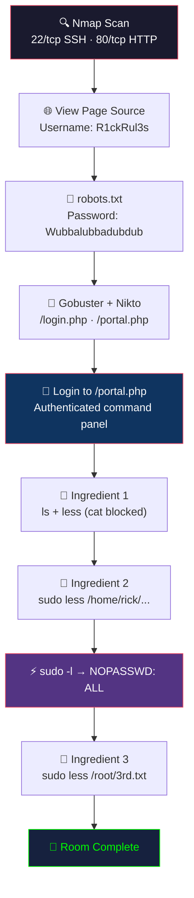

# Midterm — TryHackMe: Pickle Rick

> **Submission date:** 2025-03-03 · **Midterm exam for CSC-7311**
> **Room:** [TryHackMe — Pickle Rick](https://tryhackme.com/room/picklerick) (free tier)
> **Difficulty:** Easy · **Category:** Web exploitation + privilege escalation

## Table of Contents

- [Objective](#objective)
- [Attack Flow](#attack-flow)
- [Methodology](#methodology)
- [Steps 1–9](#step-1--initial-reconnaissance-port--service-scan)
- [Tool Summary](#tool-summary)
- [Key Learnings](#key-learnings)
- [Remediation Recommendations](#remediation-recommendations)
- [Mapping to OWASP Top 10](#mapping-to-owasp-top-10)
- [Mapping to MITRE ATT&CK](#mapping-to-mitre-attck)

## Attack Flow



## Objective

Retrieve three "secret ingredients" hidden on the target machine so that Rick can transform back into a human. The challenge mimics a realistic web application penetration test: reconnaissance → web enumeration → credential discovery → authenticated command execution → sudo-based privilege escalation.

> [!TIP]
> The TryHackMe room does **not** walk through the exploitation — the tester chooses the approach.

## Methodology

This walkthrough follows the canonical penetration-testing lifecycle:

1. **Reconnaissance** → Nmap port/service scan
2. **Enumeration** → Web app inspection + directory brute-forcing
3. **Credential discovery** → HTML source + `robots.txt`
4. **Exploitation** → authenticated command panel
5. **Post-exploitation** → file discovery with restricted shell bypass
6. **Privilege escalation** → `sudo -l` enumeration + root-level file read

## Target Information

| Field | Value |
|---|---|
| Target IP | `10.10.13.213` (ephemeral) |
| Platform | TryHackMe VPN (`tun0`) |
| Attacker | Kali Linux VM on VirtualBox |

---

## Step 1 — Initial Reconnaissance (Port & Service Scan)

**Tool:** Nmap
**Reason:** identify open ports and running services as the foundation for all subsequent activity.

**Command:**

```bash
nmap -A -T4 -p- 10.10.13.213 -v -oN results
```

**Flags:**

- `-A` — enable OS detection, version detection, script scanning, and traceroute
- `-T4` — aggressive timing (safe against CTF targets)
- `-p-` — scan all 65,535 ports (no assumptions about service placement)
- `-v` — verbose progress output
- `-oN results` — human-readable output file for reporting

**Expected outcome:** discover HTTP (80/tcp) and SSH (22/tcp) services.

**Actual outcome:**

- **22/tcp SSH** — open, but no credentials yet
- **80/tcp HTTP** — open, a web application is running
- No other open ports of interest

**Finding:** SSH alone is useless without credentials, so the attack path must begin on HTTP.


---

## Step 2 — Web Enumeration (HTML Source Inspection)

**Tool:** Web browser + View Page Source
**Reason:** HTML comments and inline scripts routinely leak information the developer didn't intend the user to see.

**Action:**

1. Navigate to `http://10.10.13.213`
2. Right-click → View Page Source
3. Search for comments and hidden elements

**Expected outcome:** discover a username or administrator hint embedded in the HTML.

**Actual outcome:** a username was visible in an HTML comment:

```text
Username: R1ckRul3s
```

**Finding:** username obtained — now need a password.


---

## Step 3 — Check `robots.txt` for More Clues

**Tool:** curl
**Reason:** `robots.txt` is a crawler directive file and is frequently used as a dumping ground for paths the developer assumes won't be discovered.

**Command:**

```bash
curl http://10.10.13.213/robots.txt
```

**Expected outcome:** possibly disclose hidden directories or, in a poorly configured CTF, a credential.

**Actual outcome:** the file contained a single string that proved to be a password:

```text
Wubbalubbadubdub
```

**Finding:** candidate password found. Credentials are now `R1ckRul3s` / `Wubbalubbadubdub`.


---

## Step 4 — Directory & File Enumeration

**Tools:** Gobuster, Nikto
**Reason:** the root page doesn't expose a login form. Directory enumeration finds hidden admin interfaces.

**Commands:**

```bash
gobuster dir -u http://10.10.13.213 \
  -w /usr/share/wordlists/dirbuster/directory-list-2.3-medium.txt \
  -x php,html,txt

nikto -host http://10.10.13.213
```

**Flag explanation:**

- `-w` — wordlist to brute-force directory / filenames
- `-x php,html,txt` — test each candidate with these extensions

**Expected outcome:** discover standard admin paths — `/admin.php`, `/login.php`, `/portal.php`.

**Actual outcome:** `/login.php` and `/portal.php` were found.

**Finding:** `/portal.php` was the intended login surface.


---

## Step 5 — Login to the Web Panel

**Tool:** Web browser
**Reason:** use the credentials discovered in Steps 2 & 3 against the login form discovered in Step 4.

**Action:**

1. Navigate to `http://10.10.13.213/portal.php`
2. Enter `Username: R1ckRul3s`
3. Enter `Password: Wubbalubbadubdub`
4. Submit

**Expected outcome:** successful login → access to some form of administrative interface.

**Actual outcome:** successful login. The resulting panel exposed a **command-execution input box** — the panel ran shell commands on the server and returned their output.

**Finding:** this is a full RCE (remote code execution) via a built-in feature, not a vulnerability in the traditional sense — it's an intentionally exposed shell interface. Treat the session as a low-privilege shell.


---

## Step 6 — Find the First Ingredient

**Tool:** Linux shell primitives (`ls`, `less`)
**Reason:** enumerate files in the working directory and read the candidate file.

**Commands issued through the web panel:**

```bash
ls -a
less Sup3rS3cretPickl3Ingred.txt
```

**Expected outcome:** read the file with `cat`.

**Actual outcome:** `cat` was **disabled** (likely via PATH manipulation or command filtering). Alternate file readers (`less`, `more`, `head`, `tail`, `nl`, `awk 'NR'`, `base64 | base64 -d`) worked — `less` returned the first ingredient successfully.

**Finding:** *First ingredient retrieved.* Defensive lesson: blocking a single binary does not eliminate a capability; dozens of Unix utilities can read a file.


---

## Step 7 — Find the Second Ingredient

**Tool:** Linux shell (`ls`, `sudo`, `less`)
**Reason:** second ingredient not in the web root — enumerate other user home directories.

**Commands:**

```bash
ls -a /home/rick
sudo less "/home/rick/second ingredients"
```

**Expected outcome:** file in rick's home directory, readable with sudo.

**Actual outcome:** file discovered (noting the **literal space** in the filename — required escaping with `\` or quoting). `cat` still disabled; `sudo less` worked, confirming the www-data user has sudo access.

**Finding:** *Second ingredient retrieved.* Also revealed: the web-panel user has broader sudo access than typical — a classic misconfiguration.


---

## Step 8 — Find the Third Ingredient (Privilege Escalation)

**Tool:** `sudo -l` + `sudo less`
**Reason:** confirm full sudo capabilities before attempting a root-read.

**Commands:**

```bash
sudo -l
sudo ls -a /root
sudo less /root/3rd.txt
```

**`sudo -l` output (paraphrased):**

```text
User www-data may run the following commands on the target:
    (ALL) NOPASSWD: ALL
```

**Expected outcome:** `sudo -l` reveals permitted commands; `/root` should contain the final ingredient if sudo is broad.

**Actual outcome:** www-data had **unrestricted sudo with no password required** (`NOPASSWD: ALL`). This is equivalent to root access. The third ingredient was in `/root/3rd.txt`.

**Finding:** *Third ingredient retrieved.* The webshell-as-www-data compromise effectively meant root compromise from the moment credentials were reused.


---

## Step 9 — Challenge Completion

Submitted three ingredients via TryHackMe's room interface. Room marked Complete.


---

## Tool Summary

| Tool | Purpose |
|---|---|
| **Nmap** | Network scan — identify open ports and running services |
| **Gobuster / Nikto** | Directory enumeration — find hidden web paths |
| **curl** | Fetch `robots.txt` / manual HTTP inspection |
| **Web Browser** | View page source, explore web app, authenticate |
| **Linux shell (`ls`, `less`)** | Interact with the command-execution panel for file discovery |
| **sudo / sudo -l** | Enumerate and abuse privilege escalation paths |

---

## Key Learnings

> [!NOTE]
> These takeaways apply directly to real-world penetration testing engagements.

1. **Information leakage compounds.** A single leaked username + a single leaked password = full authentication. In production, treat `robots.txt` and HTML comments as public.
2. **`cat` is not the only file reader.** Any command filter that blocks only a few binaries can be bypassed trivially — denylists are almost always incomplete. Alternatives: `less`, `more`, `head`, `tail`, `nl`, `awk`, `sed`, `base64 -d`.
3. **`NOPASSWD: ALL` is catastrophic.** A single sudoers misconfiguration neutralizes every other hardening measure. This is the most common privilege escalation vector in CTFs and real environments alike.
4. **Authenticated RCE is still RCE.** Features that execute user-supplied shell commands need auth AND authorization AND input sanitization. A command panel is a shell by another name.
5. **Directory brute-forcing is fast and cheap.** Always run Gobuster against a target early; the cost is low and the yield is high.

---

## Remediation Recommendations

> [!WARNING]
> These findings represent **critical misconfigurations** that would be flagged in any professional pentest engagement.

If this were a real engagement, the following remediation would be recommended:

| # | Finding | Severity | CVSS 3.1 | Recommendation |
|---|---|---|---|---|
| 1 | Credentials in HTML comments | **High** | 7.5 | Remove all developer comments from production HTML. Implement code-review gates that scan for credential patterns before deployment. |
| 2 | Password exposed in `robots.txt` | **Critical** | 9.8 | Never store credentials in web-accessible files. Rotate all credentials immediately. Audit `robots.txt` as part of deployment checklist. |
| 3 | Unauthenticated command execution panel | **Critical** | 10.0 | Remove the command panel entirely, or restrict to localhost-only access with MFA. No web application should expose a shell interface. |
| 4 | Ineffective `cat` command filter | **Medium** | 5.3 | Denylist-based command filtering is fundamentally broken. Use allowlists or remove shell access entirely. |
| 5 | `sudo NOPASSWD: ALL` for www-data | **Critical** | 9.8 | Apply principle of least privilege. Web service accounts should never have sudo access. If needed, restrict to specific commands only. |

**Risk Summary:** This system has **zero effective security layers** once the attacker discovers the exposed credentials. Defense-in-depth was completely absent.

---

## Mapping to OWASP Top 10

| Step | OWASP category |
|---|---|
| Credential discovery via HTML comments / robots.txt | **A05 Security Misconfiguration** |
| Authenticated command execution panel | **A03 Injection** (OS Command) |
| `sudo NOPASSWD: ALL` | **A01 Broken Access Control** + **A05 Misconfiguration** |
| `cat` filter bypassed with `less` | Ineffective control design (A04 Insecure Design) |

## Mapping to MITRE ATT&CK

| Step | Tactic → Technique |
|---|---|
| Nmap scan | Reconnaissance → [T1595 Active Scanning](https://attack.mitre.org/techniques/T1595/) |
| Directory brute-force | Reconnaissance → [T1595.003 Wordlist Scanning](https://attack.mitre.org/techniques/T1595/003/) |
| Credentials in HTML / robots.txt | Credential Access → [T1552.001 Credentials in Files](https://attack.mitre.org/techniques/T1552/001/) |
| Web panel shell | Execution → [T1059 Command and Scripting Interpreter](https://attack.mitre.org/techniques/T1059/) |
| sudo abuse | Privilege Escalation → [T1548.003 Sudo and Sudo Caching](https://attack.mitre.org/techniques/T1548/003/) |

---

*Walkthrough back-reference:* [Course README](../README.md) · [Final Exam: Boiler CTF](final-boiler-ctf.md) · [Week 12: Mr. Robot CTF](mr-robot-ctf.md)
