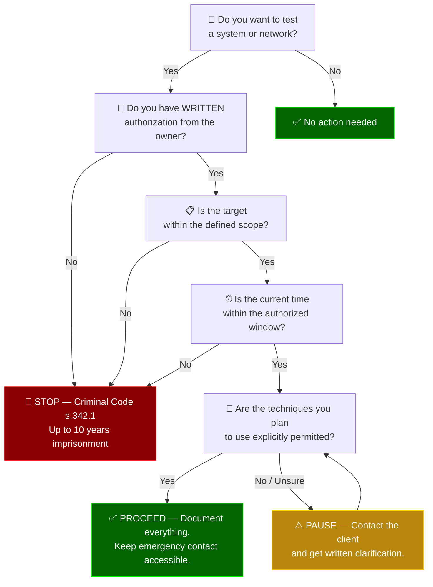

# Legal & Ethical Framework

> "You are going to jail for that kind of thing. Especially these days." — J. Caldwell, Week 1

The single most important distinction in this course: **authorized penetration testing is a professional service; unauthorized intrusion is a criminal offence.** The techniques are identical. The paperwork is what separates a career from a prosecution.

---

## The Canadian Criminal Code

> [!CAUTION]
> Without **express written authorization**, running any offensive tool against any system you do not own constitutes a potential indictable offence under the Criminal Code. This is the single brightest line in the profession.

Canada criminalizes unauthorized computer access primarily through:

### s. 342.1 — Unauthorized Use of a Computer

Prohibits:

- Fraudulently obtaining computer services
- Intercepting computer functions
- Using / obtaining a computer system to commit an offence
- Possessing / trafficking in passwords or devices that can be used to commit an offence

Maximum penalty: **10 years imprisonment** (indictable offence).

### s. 430(1.1) — Mischief to Data

Prohibits willfully:

- Destroying, altering, rendering meaningless, or obstructing data
- Denying access to data by authorized persons

Maximum penalty: **life imprisonment** if actual danger to life; **10 years** otherwise.

### s. 184 — Interception of Private Communications

Covers packet capture, wiretapping, and eavesdropping without consent.

### Supporting sections

- **s. 326** — theft of telecommunications service
- **s. 327** — possession of a device to obtain telecommunications service
- **s. 342.2** — possession of a device to obtain unauthorized computer use

### What this means for a pentester

> [!WARNING]
> Running Nmap, Gobuster, Hydra, or any other offensive tool against a target without written authorization is potentially criminal — even if no damage is caused and no data is exfiltrated.

Without **express written authorization**, running any offensive tool against any system you do not own potentially constitutes an indictable offence. Authorization must:

1. Be in writing
2. Identify the authorizer and their authority to grant it
3. Identify specific systems, IP ranges, domains, or applications in scope
4. Identify specific techniques permitted or prohibited (e.g., "no DoS", "no social engineering of employees")
5. Define a time window
6. Include an emergency contact and escalation path

---

## Canadian Privacy Law — PIPEDA

The **Personal Information Protection and Electronic Documents Act** governs how private-sector organizations collect, use, and disclose personal information. A penetration tester who accesses personal information during an engagement must:

- **Minimize collection** — only access data necessary to demonstrate the finding
- **Secure storage** — encrypted, access-controlled, retention-limited
- **Limit disclosure** — finding reports redact or summarize personal information
- **Notify breaches** — if the engagement reveals an ongoing breach, the client has notification obligations to the Office of the Privacy Commissioner and to affected individuals

Provincial variants (Québec's Law 25, Alberta's PIPA, BC's PIPA) add additional obligations.

---

## The Classification of Hackers

Traditional terminology:

| Term | Meaning |
|---|---|
| **White hat** | Ethical hacker operating with authorization |
| **Black hat** | Malicious hacker committing unauthorized intrusion |
| **Grey hat** | Acting with some ethical intent but without authorization (e.g., reporting findings discovered via illegal access) |

The course noted this language is **being replaced** with:

| Term | Meaning |
|---|---|
| **Authorized user** | Contracted, scoped, written permission |
| **Unauthorized user** | No permission; criminal activity |
| **Semi-authorized user** | Good intent, no explicit authorization |

"Anonymous" was discussed as an ambiguous case — their classification depends on which sub-group is acting and what target.

---

## Responsible Disclosure

When a pentester (or independent researcher) discovers a vulnerability in third-party software:

1. **Notify the vendor privately** with technical detail, affected versions, and a proof of concept
2. **Set a disclosure deadline** — commonly 90 days (Google Project Zero standard) to 180 days
3. **Collaborate on remediation** — offer to verify the fix
4. **Coordinate public disclosure** — joint announcement after the patch is available
5. **Check for bug bounty** — many vendors pay for responsibly-disclosed findings

### When the vendor ignores you

Discussed in class: the grey area. If a vendor refuses to fix a serious vulnerability, the researcher faces a tension between:

- **Public safety** — users deserve to know they are at risk
- **Harm reduction** — premature disclosure enables attackers before patches exist

The course instructor's view: **if the vendor refuses to act, and the information was obtained legally, public disclosure to force remediation can be defensible** — but with caveats:

- You did not break license agreements, EULAs, or reverse-engineering restrictions
- You did not access production systems or user data to obtain the finding
- You gave reasonable time for the vendor to respond
- You include mitigations (e.g., "disable the vulnerable feature until patched") in the public notice

If techniques to obtain the finding involved unauthorized access, public disclosure exposes the researcher to criminal liability.

---

## Bug Bounty Programs

Many large vendors formalize the reward structure:

| Program | Target |
|---|---|
| Microsoft Bug Bounty | Azure, Windows, M365 |
| Google VRP / Project Zero | Google products + open-source |
| Apple Security Bounty | iOS, macOS, hardware |
| HackerOne / Bugcrowd platforms | Aggregated programs for hundreds of vendors |
| Zero Day Initiative (ZDI) | Independent; acquires vulnerabilities for disclosure |

Payout tiers are risk-proportional — a critical RCE in authentication might pay $50,000–$250,000+, while an XSS in a minor page might pay $500.

The instructor noted: when operating under a pentest contract, **check whether a bug-bounty-eligible finding can also be claimed** — some contracts assign that right to the client, others leave it with the researcher.

---

## NDAs and Contract Scoping — Minimum Clauses

> [!IMPORTANT]
> A penetration test without a written contract is not a penetration test — it is unauthorized access. The contract protects both the tester and the client.

A defensible pentest contract addresses:

| Clause | Purpose |
|---|---|
| **Scope** | Specific systems, IP ranges, domains, applications |
| **Out-of-scope** | What you cannot touch (third-party SaaS, customer data, production DBs) |
| **Time window** | Start / end dates, preferred hours, blackout periods |
| **Techniques** | Permitted attacks (web app), prohibited ones (DDoS, phishing of employees, destructive proofs) |
| **Emergency contact** | Who to call if you accidentally DoS something |
| **Rules of engagement** | Credential handling, data exfiltration simulation, cleanup obligations |
| **Confidentiality** | How findings are stored, transmitted, and destroyed |
| **Safe harbour** | Explicit statement that permitted activities are authorized for s. 342.1 purposes |
| **Indemnity** | Who is liable if something breaks |
| **Deliverables** | Report format, review cycle, retest provisions |

Without these, the engagement is unsafe **for both parties** — the client may fail to inform their cloud provider (triggering AWS/Azure abuse reports), and the tester may step outside scope and accidentally commit an offence.

---

## Ethical Behaviour as the Cornerstone

The course emphasized that being a penetration tester requires behaviour that goes **beyond** legal compliance:

1. **Responsible disclosure** — balancing public knowledge with patch availability
2. **Confidentiality** — respecting trademark / proprietary information under NDA
3. **No misuse of tools or equipment** — tools granted for the engagement stay in the engagement
4. **Transparency and communication** — keep clients informed about progress and changes in approach
5. **Scope discipline** — if you find something out of scope, document it and stop; do not continue

> "Something can be observed as an illegal activity if you're outside of the bounds of where you're supposed to be." — J. Caldwell, Week 1

---

## Authorization Decision Tree

---

## Useful References

- [Criminal Code of Canada, s. 342.1](https://laws-lois.justice.gc.ca/eng/acts/C-46/section-342.1.html)
- [PIPEDA — Office of the Privacy Commissioner](https://www.priv.gc.ca/en/privacy-topics/privacy-laws-in-canada/the-personal-information-protection-and-electronic-documents-act-pipeda/)
- [Canadian Centre for Cyber Security](https://www.cyber.gc.ca/)
- [HackerOne Disclosure Guidelines](https://www.hackerone.com/disclosure-guidelines)
- [Google Project Zero Disclosure Policy](https://googleprojectzero.blogspot.com/p/vulnerability-disclosure-policy.html)

---

## Canada's Anti-Spam Legislation (CASL)

**Statute:** [S.C. 2010, c. 23](https://laws-lois.justice.gc.ca/eng/acts/E-1.6/)

**Relevance to penetration testing:** CASL regulates more than marketing email — it prohibits the **installation of computer programs without consent** (s. 8), which directly affects:

- Deploying reverse shells, keyloggers, or persistence mechanisms on target systems
- Installing enumeration scripts (LinPEAS, pspy) on compromised hosts
- Any post-exploitation tool that modifies the target's software environment

**Key provisions:**

| Section | Provision | Pentesting implication |
|---|---|---|
| s. 8(1) | No person shall install a computer program on another person's computer system without express consent | Every payload deployed during an engagement requires **prior written authorization** in the Rules of Engagement |
| s. 8(1)(b) | Consent must be informed — the person must understand the program's function | Scope documents must describe categories of tools (shells, scanners, persistence agents) to be used |
| s. 10 | Due diligence defence | Maintaining detailed logs of all tools deployed, with timestamps, supports a due diligence claim |

> [!CAUTION]
> CASL violations carry penalties up to **$1 million (individual)** or **$10 million (corporation)** per violation. Unlike Criminal Code offences, CASL is enforced through administrative monetary penalties — no criminal conviction required.

**Best practice:** Include a CASL acknowledgment clause in every penetration testing contract alongside the Criminal Code authorization discussed above. The clause should:
1. List categories of software to be installed (shells, scanners, privilege escalation tools)
2. Specify retention and removal obligations (all tools removed within 24 hours of engagement end)
3. Reference CASL s. 8 explicitly so both parties demonstrate informed consent

---

_Previous page:_ [Cyber Kill Chain](cyber-kill-chain.md) · _Next page:_ [Tools Reference](tools.md)
