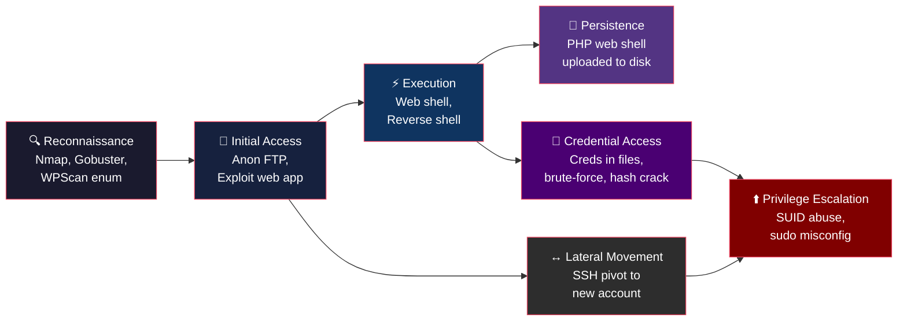

# MITRE ATT&CK — Technique Reference

> Study companion consolidating every ATT&CK technique exercised across the three CTF walkthroughs in CSC-7311. Where the Cyber Kill Chain provides a **strategic**, linear model of an attack ("what phase are we in?"), ATT&CK provides a **tactical**, technique-level matrix ("what specific method is the attacker using?"). ATT&CK's 14 tactics and 200+ techniques let defenders map detections to granular behaviours rather than abstract phases — making it the industry standard for detection engineering, red-team scoring, and gap analysis.

---

## Consolidated Technique Mapping

Every technique observed across the three course CTFs, with ATT&CK tactic, technique ID, and the specific action that triggered it.

| CTF Room | Action Performed | ATT&CK Tactic | Technique ID | Technique Name |
|---|---|---|---|---|
| **Pickle Rick** | Nmap scan | Reconnaissance | [T1595](https://attack.mitre.org/techniques/T1595/) | Active Scanning |
| **Pickle Rick** | Directory brute-force (dirb) | Reconnaissance | [T1595.003](https://attack.mitre.org/techniques/T1595/003/) | Wordlist Scanning |
| **Pickle Rick** | Credentials in HTML source / `robots.txt` | Credential Access | [T1552.001](https://attack.mitre.org/techniques/T1552/001/) | Credentials in Files |
| **Pickle Rick** | Web panel command execution | Execution | [T1059](https://attack.mitre.org/techniques/T1059/) | Command and Scripting Interpreter |
| **Pickle Rick** | `sudo` abuse (no password) | Privilege Escalation | [T1548.003](https://attack.mitre.org/techniques/T1548/003/) | Sudo and Sudo Caching |
| **Mr. Robot** | Nmap scan | Reconnaissance | [T1595](https://attack.mitre.org/techniques/T1595/) | Active Scanning |
| **Mr. Robot** | `robots.txt` key exposure | Reconnaissance | [T1592](https://attack.mitre.org/techniques/T1592/) | Gather Victim Host Information |
| **Mr. Robot** | Gobuster directory enumeration | Reconnaissance | [T1595.003](https://attack.mitre.org/techniques/T1595/003/) | Wordlist Scanning |
| **Mr. Robot** | WPScan user enumeration | Reconnaissance | [T1589](https://attack.mitre.org/techniques/T1589/) | Gather Victim Identity Information |
| **Mr. Robot** | WPScan brute-force | Credential Access | [T1110.001](https://attack.mitre.org/techniques/T1110/001/) | Password Guessing |
| **Mr. Robot** | Theme editor PHP upload (web shell) | Persistence | [T1505.003](https://attack.mitre.org/techniques/T1505/003/) | Web Shell |
| **Mr. Robot** | Reverse shell via PHP | Execution | [T1059.004](https://attack.mitre.org/techniques/T1059/004/) | Unix Shell |
| **Mr. Robot** | MD5 hash cracking | Credential Access | [T1110.002](https://attack.mitre.org/techniques/T1110/002/) | Password Cracking |
| **Mr. Robot** | SUID nmap escalation | Privilege Escalation | [T1548.001](https://attack.mitre.org/techniques/T1548/001/) | Setuid and Setgid |
| **Boiler CTF** | Nmap scan | Reconnaissance | [T1595.001](https://attack.mitre.org/techniques/T1595/001/) | Scanning IP Blocks |
| **Boiler CTF** | FTP anonymous login | Initial Access | [T1078.003](https://attack.mitre.org/techniques/T1078/003/) | Local Accounts |
| **Boiler CTF** | Sar2HTML RCE | Initial Access | [T1190](https://attack.mitre.org/techniques/T1190/) | Exploit Public-Facing Application |
| **Boiler CTF** | SSH login with discovered creds | Lateral Movement | [T1021.004](https://attack.mitre.org/techniques/T1021/004/) | SSH |
| **Boiler CTF** | `su stoner` with recovered password | Privilege Escalation | [T1548.003](https://attack.mitre.org/techniques/T1548/003/) | Sudo and Sudo Caching |
| **Boiler CTF** | SUID `find` escalation | Privilege Escalation | [T1548.001](https://attack.mitre.org/techniques/T1548/001/) | Setuid and Setgid |
| **Boiler CTF** | Credentials in backup file | Credential Access | [T1552.001](https://attack.mitre.org/techniques/T1552/001/) | Credentials in Files |

> [!TIP]
> **Reading technique IDs:** The format is `Tnnnn.nnn` — the first four digits identify the parent technique; the sub-number (after the dot) identifies a specific sub-technique. For example, [T1548.001](https://attack.mitre.org/techniques/T1548/001/) means "Abuse Elevation Control Mechanism → Setuid and Setgid."

---

## Tactics Observed in This Course

ATT&CK organises techniques under **tactics** — the adversary's objective at each stage. The seven tactics exercised in the course labs are described below.

### Reconnaissance

**Objective:** gather information to plan future operations.

All three CTFs began with port scanning (Nmap) and directory enumeration (dirb, Gobuster). Mr. Robot added user enumeration via WPScan. These map to ATT&CK's [Reconnaissance](https://attack.mitre.org/tactics/TA0043/) tactic because the attacker is not yet interacting with the target in a way that triggers exploitation — they are collecting intelligence.

**Techniques exercised:** T1595, T1595.001, T1595.003, T1592, T1589

### Initial Access

**Objective:** gain an initial foothold in the target environment.

Boiler CTF demonstrated two distinct initial-access paths: anonymous FTP login (valid account with default credentials) and Sar2HTML command injection (exploiting a public-facing application). Both map to [Initial Access](https://attack.mitre.org/tactics/TA0001/).

**Techniques exercised:** T1078.003, T1190

### Execution

**Objective:** run adversary-controlled code on the target.

Pickle Rick's web panel accepted arbitrary shell commands directly. Mr. Robot's reverse shell via a modified PHP theme file achieved the same result through a different vector. Both represent [Execution](https://attack.mitre.org/tactics/TA0002/) — the adversary has code running on the target system.

**Techniques exercised:** T1059, T1059.004

### Persistence

**Objective:** maintain access across restarts or credential changes.

Mr. Robot's WordPress theme-editor upload planted a PHP web shell that persisted on disk. Even if the admin session expired, the shell remained accessible. This maps to [Persistence](https://attack.mitre.org/tactics/TA0003/).

**Techniques exercised:** T1505.003

### Credential Access

**Objective:** steal account credentials.

Credentials were discovered in plaintext files (Pickle Rick, Boiler CTF), brute-forced against a login form (Mr. Robot / WPScan), and recovered by cracking an MD5 hash (Mr. Robot). All fall under [Credential Access](https://attack.mitre.org/tactics/TA0006/).

**Techniques exercised:** T1552.001, T1110.001, T1110.002

### Privilege Escalation

**Objective:** gain higher-level permissions.

Every CTF culminated in privilege escalation. Pickle Rick and Boiler CTF abused `sudo` / `su` misconfigurations. Mr. Robot and Boiler CTF exploited SUID binaries (`nmap`, `find`). These map to [Privilege Escalation](https://attack.mitre.org/tactics/TA0004/).

**Techniques exercised:** T1548.001, T1548.003

### Lateral Movement

**Objective:** move through the environment to reach additional targets.

Boiler CTF required SSH-ing from the web-server shell into a different user account on the same machine — a simple but textbook example of [Lateral Movement](https://attack.mitre.org/tactics/TA0008/).

**Techniques exercised:** T1021.004

---

## Engagement Flow

How the seven tactics chain together in a typical CTF engagement:

> [!NOTE]
> The flow above is **not strictly linear** — ATT&CK deliberately avoids the kill chain's sequential assumption. Credential access can happen at any point; lateral movement feeds back into privilege escalation; persistence may be established before or after escalation depending on the engagement.

---

## Coverage Matrix

Which techniques were exercised in which CTF room:

| Technique ID | Technique Name | Pickle Rick | Mr. Robot | Boiler CTF |
|---|---|:---:|:---:|:---:|
| [T1595](https://attack.mitre.org/techniques/T1595/) | Active Scanning | ✅ | ✅ | |
| [T1595.001](https://attack.mitre.org/techniques/T1595/001/) | Scanning IP Blocks | | | ✅ |
| [T1595.003](https://attack.mitre.org/techniques/T1595/003/) | Wordlist Scanning | ✅ | ✅ | |
| [T1592](https://attack.mitre.org/techniques/T1592/) | Gather Victim Host Info | | ✅ | |
| [T1589](https://attack.mitre.org/techniques/T1589/) | Gather Victim Identity Info | | ✅ | |
| [T1078.003](https://attack.mitre.org/techniques/T1078/003/) | Local Accounts | | | ✅ |
| [T1190](https://attack.mitre.org/techniques/T1190/) | Exploit Public-Facing App | | | ✅ |
| [T1059](https://attack.mitre.org/techniques/T1059/) | Command & Scripting Interpreter | ✅ | | |
| [T1059.004](https://attack.mitre.org/techniques/T1059/004/) | Unix Shell | | ✅ | |
| [T1505.003](https://attack.mitre.org/techniques/T1505/003/) | Web Shell | | ✅ | |
| [T1552.001](https://attack.mitre.org/techniques/T1552/001/) | Credentials in Files | ✅ | | ✅ |
| [T1110.001](https://attack.mitre.org/techniques/T1110/001/) | Password Guessing | | ✅ | |
| [T1110.002](https://attack.mitre.org/techniques/T1110/002/) | Password Cracking | | ✅ | |
| [T1548.001](https://attack.mitre.org/techniques/T1548/001/) | Setuid and Setgid | | ✅ | ✅ |
| [T1548.003](https://attack.mitre.org/techniques/T1548/003/) | Sudo and Sudo Caching | ✅ | | ✅ |
| [T1021.004](https://attack.mitre.org/techniques/T1021/004/) | SSH | | | ✅ |

**Summary:** 16 unique techniques across 7 tactics — reasonable breadth for an introductory ethical-hacking course focused on Linux CTF targets.

---

## Techniques Not Covered

The following ATT&CK tactics were **not** exercised in the course labs. This is expected — they are typically beyond the scope of an introductory offensive-security course and require more advanced infrastructure, tooling, or longer engagement timelines.

| Tactic | Why Not Covered |
|---|---|
| **[Defense Evasion](https://attack.mitre.org/tactics/TA0005/)** | CTF targets had no EDR, AV, or logging to evade. Real engagements require techniques like obfuscation, timestomping, and indicator removal. |
| **[Collection](https://attack.mitre.org/tactics/TA0009/)** | Labs focused on capturing flags, not staging bulk data for exfiltration (screen capture, clipboard, email harvesting). |
| **[Exfiltration](https://attack.mitre.org/tactics/TA0010/)** | No need to exfiltrate data covertly from a single-box CTF. Real engagements involve encrypted channels, DNS tunneling, and staging. |
| **[Impact](https://attack.mitre.org/tactics/TA0040/)** | Destructive actions (ransomware, data destruction, defacement) are out of scope for educational labs. |
| **[Command and Control](https://attack.mitre.org/tactics/TA0011/)** | Mr. Robot's reverse shell is a rudimentary C2 channel, but no dedicated C2 framework (Cobalt Strike, Sliver, Havoc) was used. |

> [!NOTE]
> The five tactics above represent the "second half" of a real-world engagement. Covering them would require a more advanced course with multi-host lab environments, active defenses, and longer operational timelines. The [Cyber Kill Chain](cyber-kill-chain.md) reference covers the strategic model that includes these later phases.

---

## Study References

- [MITRE ATT&CK Matrix for Enterprise](https://attack.mitre.org/matrices/enterprise/) — full interactive matrix
- [MITRE ATT&CK Navigator](https://mitre-attack.github.io/attack-navigator/) — layer-based visualization tool for coverage mapping
- [ATT&CK Technique Search](https://attack.mitre.org/techniques/enterprise/) — browse all techniques with detection and mitigation guidance
- [Cyber Kill Chain](cyber-kill-chain.md) — the complementary strategic model (see the comparison table there)
- [OWASP Top 10](owasp-top-10.md) — web-application risk catalog mapped to the same CTF labs

---

Back to [course README](../README.md) · [References](README.md)
