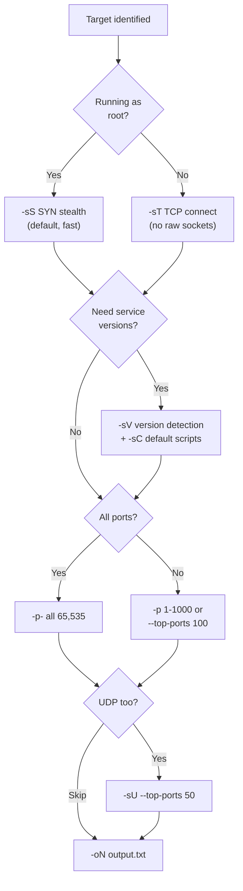

# Week 4 — Further Nmap, OSI Model, Reconnaissance, Web App Security Intro (Module 03)

> **Date:** 2025-01-27 · **Deliverable:** Lab 3 walkthrough (Module 03)

## Session Summary

Deep-dive on **Nmap** as the foundational scanning tool, an OSI-model refresher oriented toward attack-surface thinking, and an introduction to web application security that established the vocabulary used throughout the remaining CTFs.

## Nmap Scan Type Decision Tree



## Topics Covered

### 1. Further Nmap (Beyond Basic Scanning)

Building on the introductory Nmap exposure, this session covered:

| Flag Combination | Purpose |
|---|---|
| `-sS` | SYN stealth scan (default when running as root) |
| `-sT` | TCP connect scan (when raw sockets unavailable) |
| `-sU` | UDP scan (slow; use with `--top-ports`) |
| `-sV` | Service/version detection |
| `-sC` | Default NSE script scan |
| `-O` | OS fingerprinting |
| `-A` | Aggressive: `-sV -sC -O --traceroute` |
| `-p-` | All 65,535 ports |
| `-T0` through `-T5` | Timing templates (paranoid → insane) |
| `-oN/-oA/-oX` | Output formats (normal / all / XML) |
| `--script` | Specific NSE script invocation |

**Example canonical command:**

```bash
sudo nmap -sC -sV -p- -oN nmap_full.txt <target>
```

Detailed treatment: [references/tools.md#nmap](../references/tools.md#nmap)


### 2. OSI Model — Attack Surface View

Revisited the 7 layers with a penetration-tester lens: **which attacks live at which layer?**

| Layer | Attacks |
|---|---|
| 7. Application | XSS, SQLi, command injection, deserialization, business logic |
| 6. Presentation | TLS downgrade, weak cipher exploitation, certificate mis-validation |
| 5. Session | Session hijacking, session fixation, token prediction |
| 4. Transport | Port scanning, TCP SYN flood, RST injection, sequence prediction |
| 3. Network | ARP spoofing (between L2/L3 in practice), routing attacks, ICMP abuse |
| 2. Data Link | MAC flooding, VLAN hopping, STP attacks, ARP poisoning |
| 1. Physical | Cable tapping, shoulder surfing, hardware implants |


> [!TIP]
> When running Nmap, think in OSI layers: `-sS` operates at Layer 4 (Transport), `-sV` probes Layer 7 (Application), and `-O` fingerprints via Layer 3 (Network) TTL behaviour. Mapping each flag to its layer turns scan design from guesswork into a systematic process.

### 3. Reconnaissance Techniques (Applied)

Hands-on practice with:

- WHOIS lookups on student-chosen targets
- DNS enumeration (`dig`, `nslookup`, `dnsrecon`)
- Subdomain discovery
- Certificate-transparency mining via `crt.sh`
- Shodan query practice

### 4. Web App Security — Introduction

First exposure to OWASP terminology and the attack categories that Weeks 8, 12, and 13 would fully exercise:

- Injection (SQLi, OS command, LDAP)
- Broken access control
- Security misconfiguration
- Cryptographic failures
- Vulnerable/outdated components

Full treatment: [references/owasp-top-10.md](../references/owasp-top-10.md)

## Lab 3 Deliverables

Three separate submissions captured the week's lab work:

1. **Further Nmap** — extended scan techniques, NSE scripts, output formats
2. **Further Nmap** (revision) — refined version with additional screenshots
3. **Module 03 — OSI & Recon — Intro to Web App Security** — combined deliverable covering OSI mapping, recon techniques, and OWASP introduction

Each submission followed the course format: tool used → reason → expected outcome → actual outcome → screenshot evidence.

## TryHackMe Rooms Referenced

- [Nmap](https://tryhackme.com/room/furthernmap) — further Nmap techniques
- [OWASP Top 10](https://tryhackme.com/room/owasptop10) — introduction (expanded in Week 13)

> [!NOTE]
> The `-A` aggressive flag combines four scans (`-sV -sC -O --traceroute`) into one command. Convenient in labs, but in a real engagement, running each separately gives finer control over timing and noise.

## Key Takeaway

Mapping attacks to OSI layers transformed Nmap from "a port scanner" into "a tool that tells me which layers of the target are exposed." Thinking in layers makes enumeration systematic rather than ad hoc — and it makes the results far easier to communicate to a client who understands the OSI model but not the tooling.

## References from this Session

- [Tools — Nmap section](../references/tools.md#nmap)
- [OWASP Top 10](../references/owasp-top-10.md)
- [Methodology](../references/methodology.md) — Phase 2 enumeration

---

_Previous:_ [Week 3](week-03-cyber-kill-chain.md) · _Next:_ [Week 5](week-05-enumeration-brute-force-openvas.md)
