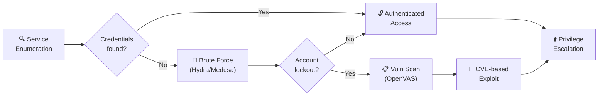

# Week 5 — Enumeration, Brute Force, OpenVAS Scanner

> **Date:** 2025-02-03 · **Deliverable:** Enumeration & Brute Force + OpenVAS lab walkthrough

## Session Summary

Shifted from reconnaissance-at-a-distance to **active enumeration** — probing services for versions, users, shares, and misconfigurations — then onto **credential brute-forcing** and automated **vulnerability scanning** with OpenVAS.

## Enumeration → Exploitation Flow



## Topics Covered

### 1. Service Enumeration

Per-service enumeration techniques:

| Service | Enumeration Approach |
|---|---|
| **SMB (445/tcp)** | `enum4linux`, `smbclient -L`, `smbmap`, null-session testing |
| **SMTP (25/tcp)** | `VRFY`, `EXPN`, `RCPT TO` user enumeration; relay testing |
| **FTP (21/tcp)** | Anonymous login test, banner grab, writable directory discovery |
| **SSH (22/tcp)** | Version detection for CVE alignment, supported auth methods |
| **DNS (53/tcp/udp)** | Zone transfers (`dig @server domain AXFR`), subdomain brute-force |
| **HTTP (80/443)** | Banner grab, directory brute-force, cookie analysis, header inspection |
| **SNMP (161/udp)** | Community string brute-force (`public`, `private`); MIB walking |
| **LDAP (389)** | Anonymous bind test, naming-context enumeration |

### 2. Brute-Force Techniques

| Tool | Target |
|---|---|
| **Hydra** | Network protocols — SSH, FTP, HTTP forms, RDP, SMB, MySQL |
| **Medusa** | Similar coverage to Hydra, different concurrency model |
| **Patator** | Flexible brute-force with modular target support |
| **WPScan** | WordPress-specific (weeks 11/12) |
| **John the Ripper** | Offline password-hash cracking |
| **Hashcat** | GPU-accelerated hash cracking |

**Canonical Hydra invocation:**

```bash
hydra -l admin -P /usr/share/wordlists/rockyou.txt ssh://<target>
```

**Lockout awareness:** the session emphasized that real-world brute-force attempts trigger lockouts and IDS alarms. In lab environments this is ignored; in a real engagement, rate-limiting + source-IP rotation + jitter are required.

> [!WARNING]
> In a real engagement, brute-force attacks can trigger account lockouts that cause a denial-of-service for legitimate users. Always confirm the lockout policy with the client before running Hydra or similar tools — and document that agreement in the rules of engagement.

### 3. OpenVAS (Greenbone Vulnerability Scanner)

**OpenVAS** (now branded Greenbone Community Edition) is an open-source vulnerability scanner comparable to commercial Nessus.

**Installation:**

```bash
sudo apt install openvas
sudo gvm-setup
sudo gvm-start
```

**Web UI:** `https://localhost:9392/`

**Setup steps:**

1. Create scan **target** (IP or range)
2. Create **task** (associate target with scan config)
3. Run task
4. Review **report** — findings by severity, CVSS score, description, remediation

**Scan configurations:**

- **Full and fast** — default for most engagements
- **Full and deep** — more thorough, slower
- **Discovery** — service inventory only
- **Host Discovery** — alive-host identification

### 4. Report Interpretation

The exercise included interpreting an OpenVAS report:

- **High severity** findings prioritized first
- **CVSS 3.x scoring** understood across exploitability + impact dimensions
- **False positive triage** — vulnerability scanners over-report; each finding must be verified
- **Remediation mapping** — findings translated into patch/config/architectural actions


> [!TIP]
> Always run OpenVAS with the "Full and fast" config first. The "Full and deep" option can take hours on even a small subnet, and the marginal findings rarely justify the time cost in a time-boxed engagement.

## Lab Deliverable

Combined deliverable covered:

- Hands-on enumeration against lab targets (probably TryHackMe enumeration rooms)
- Brute-force demonstration with Hydra
- OpenVAS installation, scan execution, report review

Source file: `Week 5/A00322717 Ross Moravec Enumeration Brute Force OpenVAS Scanner.docx` (2.5 MB, 2 embedded sections with screenshots).

## TryHackMe Rooms Referenced

- [Further Nmap](https://tryhackme.com/room/furthernmap)
- [Hydra](https://tryhackme.com/room/hydra)
- [Common Attacks](https://tryhackme.com/room/commonattacks)

## Key Takeaway

OpenVAS showed me that vulnerability scanners are noisy, imprecise, and absolutely essential. The real skill isn't running the scan — it's triaging the false positives and translating findings into actionable recommendations that a client can actually prioritize. That interpretation layer is where the value of a human analyst lives.

## References from this Session

- [Tools — Brute force section](../references/tools.md#hydra)
- [Tools — OpenVAS section](../references/tools.md#openvas--greenbone)
- [Methodology](../references/methodology.md) — Phase 2 (scanning) and Phase 3 (initial exploitation)

---

_Previous:_ [Week 4](week-04-nmap-osi-web-app-security.md) · _Next:_ [Week 6](week-06-network-services.md)
