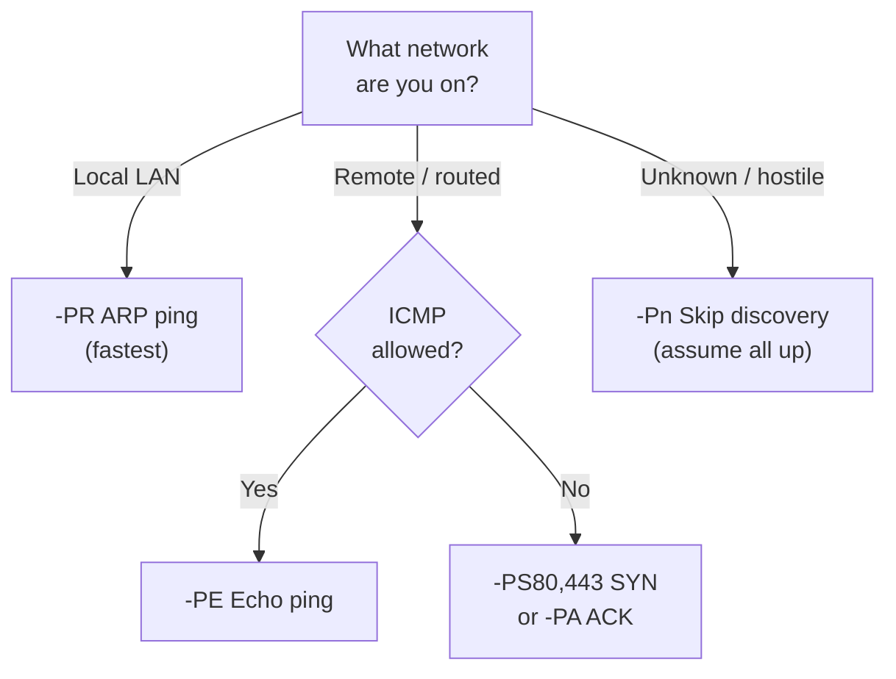

# Week 11 — Live Host Scanning + Wireless Hacking 101

> **Date:** 2025-03-24 · **Deliverable:** Dual lab submission (Nmap Live Host Discovery + Wireless Hacking 101)

## Session Summary

A two-part session: first deepening the Nmap skill set with **live-host discovery** techniques on internal networks, then a broad survey of **wireless attack concepts** including physical demonstrations with the Wi-Fi Pineapple and Flipper Zero.

## Part 1 — Live Host Scanning (Nmap)

### Why "live host discovery" is its own topic

When testing an **internal network** (post-foothold), the tester must identify which hosts are alive before running expensive service scans against an entire `/16` subnet. Naive approaches (scan every IP with full port scan) take days; targeted discovery finishes in minutes.



> [!NOTE]
> **ARP is king on the local LAN.** When you're on the same Layer 2 segment as your targets, `-PR` (ARP ping) is the fastest and most reliable discovery method — it bypasses host firewalls entirely because ARP is required for basic network communication. Always default to ARP scans for internal engagements.

### Nmap Discovery Techniques

| Flag | Technique |
|---|---|
| `-sn` | Ping scan — no port scan, just alive check |
| `-Pn` | Skip discovery — assume all hosts alive (slower, less stealthy) |
| `-PS<ports>` | TCP SYN to specified ports |
| `-PA<ports>` | TCP ACK to specified ports |
| `-PU<ports>` | UDP probe |
| `-PE` | ICMP Echo (traditional ping) |
| `-PP` | ICMP Timestamp |
| `-PM` | ICMP Netmask |
| `-PR` | ARP ping (fastest on local LAN) |
| `--disable-arp-ping` | When ARP would be used by default but is undesired |

**Canonical subnet sweep:**

```bash
sudo nmap -sn 10.10.0.0/24
```

**ARP-only (fastest on local network):**

```bash
sudo nmap -sn -PR 192.168.1.0/24
```

**Stealth discovery with custom ports:**

```bash
sudo nmap -Pn -n -PS80,443,22,445 -sS --min-rate 1000 10.10.0.0/24
```

### Alternative Tools Discussed

| Tool | Niche |
|---|---|
| `fping` | Fast parallel ICMP ping |
| `arp-scan` | Layer-2 ARP sweep (local subnet only) |
| `netdiscover` | Passive ARP sniffing |
| `masscan` | Very fast TCP SYN scanner for large ranges |
| `rustscan` | Modern scanner that feeds targets to Nmap |

### Lab Deliverable (Part 1)

Source file: `Week 11/A00322717 Ross Moravec - Live Host Scanning - Nmap Live Host Discovery.docx` (1.5 MB, 1 screenshot section).


## Part 2 — Wireless Hacking 101

### Wireless Attack Surface

| Layer | Attacks |
|---|---|
| **PHY (radio)** | Jamming, sub-GHz replay, SDR eavesdropping |
| **MAC (802.11)** | Deauthentication flooding, evil-twin APs, rogue APs |
| **Auth** | WPA/WPA2 PSK cracking, WPA-Enterprise credential capture, WPS PIN brute-force |
| **Transport** | MITM via captive portal, SSL strip (downgraded) |
| **Application** | Phishing via captive portal, DNS manipulation, traffic injection |

### Attack Demonstrations

**Wi-Fi Pineapple (Hak5):**

- Portable rogue-AP device
- Impersonates any SSID the victim device remembers (PineAP)
- Runs captive portal to harvest credentials
- Demonstrated in-class with a volunteer device

**Flipper Zero:**

- Multi-function RF tool
- Demonstrated: RFID card reading/cloning, sub-GHz signal capture/replay (garage doors, TV remotes)
- NOT a magic "hack anything" tool — capability bounded by the protocols supported

### WPA/WPA2 Handshake Capture & Crack (Referenced)

```bash
# Put interface in monitor mode
sudo airmon-ng start wlan0

# Capture handshakes
sudo airodump-ng wlan0mon

# Target specific network + force handshake via deauth
sudo airodump-ng -c 6 --bssid AA:BB:CC:DD:EE:FF -w capture wlan0mon
sudo aireplay-ng -0 5 -a AA:BB:CC:DD:EE:FF wlan0mon

# Offline dictionary crack
aircrack-ng -w /usr/share/wordlists/rockyou.txt capture-01.cap
```

**Ethical note:** deauth attacks and WPA capture against networks you do not own is illegal under s. 184 (interception) and s. 342.1 (unauthorized use). Course demos used lab-owned equipment.

> [!WARNING]
> **Wireless attacks carry elevated legal risk.** Unlike network-based attacks that require logical access, wireless attacks broadcast over public airwaves and can inadvertently affect bystander devices. A deauthentication flood targeting one AP may disrupt every client on the channel. Always use RF-shielded environments or dedicated lab equipment for wireless testing.

### RFID / NFC Cloning

- **LF 125 kHz** (HID Prox, EM4100) — trivially cloneable with Flipper, Proxmark3
- **HF 13.56 MHz** (MIFARE Classic, DESFire) — MIFARE Classic broken (Crypto-1); DESFire EV2/EV3 remains strong
- **Mitigation:** modern access control uses rolling-code secure elements (HID iCLASS SE, MIFARE DESFire EV3)

### Lab Deliverable (Part 2)

Source file: `Week 11/A00322717 Ross Moravec Wireless Hacking 101 on 2025-03-24.docx` (2.7 MB, 1 screenshot section).


## TryHackMe Rooms Referenced

- [Nmap Advanced Port Scans](https://tryhackme.com/room/nmap03)
- [Nmap Live Host Discovery](https://tryhackme.com/room/nmap01)
- [Wifi Hacking 101](https://tryhackme.com/room/wifihacking101)

## References from this Session

- [Tools — Nmap](../references/tools.md#nmap)
- [Tools — Wireless section](../references/tools.md#wireless--physical)
- [Methodology](../references/methodology.md) — Phase 2 applied to internal/wireless networks

## Key Takeaway

The Wi-Fi Pineapple and Flipper Zero demos were eye-opening — the physical attack surface is often completely invisible to network defenders focused on firewalls and IDS rules. The most striking lesson was that 125 kHz RFID cards are trivially cloneable, which means physical access control is only as strong as its weakest credential technology. Organizations spending millions on network security while still issuing HID Prox cards are leaving the front door unlocked.

---

_Previous:_ [Week 10](week-10-phishing.md) · _Next:_ [Week 12](week-12-mr-robot-ctf.md)
