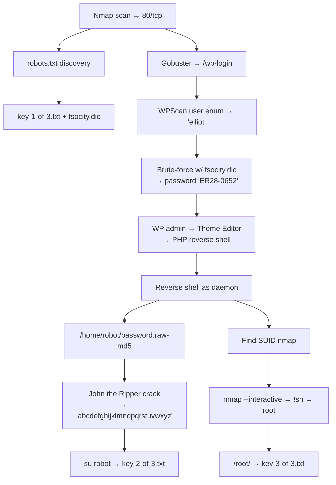

# Week 12 — Mr. Robot CTF (WordPress Exploitation)

> **Date:** ~2025-03-31 · **Deliverable:** Large lab — TryHackMe Mr. Robot CTF

## Session Summary

Full hands-on CTF exercise against a WordPress-based target themed on the USA Network TV show *Mr. Robot*. The room tests the full lifecycle: reconnaissance → CMS enumeration → brute-force → authenticated RCE → reverse shell → privilege escalation — all inside a single contained VM.

> [!NOTE]
> **WordPress powers ~40% of the public web.** The attack path demonstrated here — theme editor abuse for code execution — is not academic. It is the single most common WordPress compromise vector in the wild, and it works on any WP site where an attacker obtains admin credentials. Understanding this attack path is essential for any security professional.

## Attack Path (Summary)

## Key Techniques Exercised

- **robots.txt misconfiguration** as an info disclosure vector
- **WordPress username enumeration** via error message leakage
- **Dictionary deduplication** before brute-force (858k → 11.5k lines)
- **WPScan** for WordPress-specific brute-force
- **PHP reverse shell via theme editor** — the textbook WP admin → RCE path
- **Shell upgrade** via `python -c 'import pty; pty.spawn("/bin/bash")'`
- **MD5 cracking** with John the Ripper
- **SUID nmap privilege escalation** (older Nmap `--interactive` mode)

## Full Walkthrough

See the complete step-by-step walkthrough with tool reasoning, expected vs. actual outcomes, and commentary on defensive implications:

**→ [ctf-walkthroughs/mr-robot-ctf.md](../ctf-walkthroughs/mr-robot-ctf.md)**

## Lab Deliverable

Source file: `Week 12/A00322717 Ross Moravec Lab Mr Robot CTF Wordpress.docx` (5.6 MB — largest regular-week submission in the course, reflecting the depth of WordPress enumeration required).

## Mapping to Course Progression

This lab consolidated the techniques from Weeks 4 (Nmap/web security), 5 (enumeration/brute force), and 6 (network services), and set up the final-exam CTF on the same skills at higher difficulty.

## References from this Session

- Full walkthrough: [mr-robot-ctf.md](../ctf-walkthroughs/mr-robot-ctf.md)
- [Tools](../references/tools.md) — WPScan, John the Ripper, GTFOBins
- [OWASP Top 10](../references/owasp-top-10.md) — A07 (Auth Failures) and A05 (Misconfiguration)

## Key Takeaway

The Mr. Robot room demonstrated that a single weak password on a CMS admin panel gives an attacker complete code execution on the underlying server. WordPress' theme editor is the single most dangerous feature in the most popular CMS in the world — it turns authenticated admin access into arbitrary PHP execution with zero additional exploits required. The defensive lesson is clear: disable the theme/plugin editor in production (`define('DISALLOW_FILE_EDIT', true)` in `wp-config.php`), enforce strong credentials, and monitor for unexpected file changes.

---

*Previous:* [Week 11](week-11-live-host-scanning-wireless.md) · *Next:* [Week 13 — Final Exam](week-13-final-exam-boiler-ctf.md)
