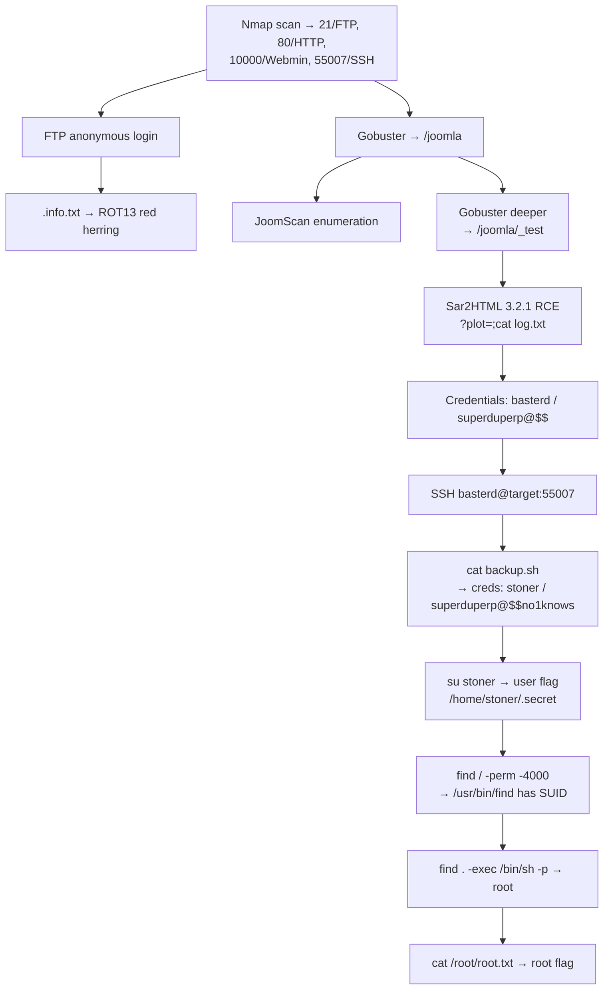

# Week 13 — Final Exam: Boiler CTF + OWASP Top 10

> **Date:** 2025-04-14 · **Deliverables:** Practical final (Boiler CTF) + OWASP Top 10 study companion

## Session Summary

The final week combined two graded items: a **practical final exam** (TryHackMe Boiler CTF, invigilated during class) and an **OWASP Top 10** written deliverable consolidating the web-security vocabulary used across the semester.

> [!TIP]
> **The final exam tested discipline, not tricks.** The Boiler CTF deliberately includes red herrings (ROT13-encoded text in FTP, rabbit-hole directories). The students who succeeded were the ones who stuck to methodology — enumerate systematically, verify every finding, and don't chase shiny objects.

## Part 1 — Final Exam: TryHackMe Boiler CTF

### Objective

End-to-end compromise: from Nmap scan → user flag → root flag, with full documentation of every step.

### Attack Path (Summary)

### Key Techniques Exercised

- Full-port Nmap scan (`-sC -sV -p-`) with non-standard SSH port discovery
- Anonymous FTP exploitation + ROT13 decoding
- Multi-level Gobuster directory brute-forcing
- JoomScan (Joomla-specific enumeration)
- **Sar2HTML 3.2.1 remote code execution** via `plot=` parameter injection
- Credential discovery in log files and shell scripts
- SSH lateral movement + `su` user switching
- **SUID `find` privilege escalation** via GTFOBins

### Full Walkthrough

**→ [ctf-walkthroughs/final-boiler-ctf.md](../ctf-walkthroughs/final-boiler-ctf.md)**

### Source Submission

`Week 13/A00322717 Ross Moravec - Final Exam - Boiler CTF.docx` (4.5 MB, 163 paragraphs, 21 screenshots) and companion `Week 13/A00322717 Ross Moravec ETH Final Exam.docx` (2.4 MB, 223 paragraphs, 20 screenshots).

## Part 2 — OWASP Top 10 Study Companion

A consolidated study deliverable covering the 2021 edition of the OWASP Top 10, with examples and mitigation strategies drawn from the course's practical CTFs.

### Categories Covered

| Rank | Category | Shift from 2017 |
|---|---|---|
| A01 | Broken Access Control | ↑ from #5 |
| A02 | Cryptographic Failures | renamed from "Sensitive Data Exposure" |
| A03 | Injection | ↓ from #1 |
| A04 | Insecure Design | NEW in 2021 |
| A05 | Security Misconfiguration | ↑ from #6 |
| A06 | Vulnerable & Outdated Components | ↑ from #9 |
| A07 | Identification & Authentication Failures | ↓ from #2 |
| A08 | Software & Data Integrity Failures | NEW in 2021 |
| A09 | Security Logging & Monitoring Failures | ↑ from #10 |
| A10 | Server-Side Request Forgery (SSRF) | NEW in 2021 |

### Full Study Companion

**→ [references/owasp-top-10.md](../references/owasp-top-10.md)**

> [!NOTE]
> **Three new categories in 2021** — Insecure Design (A04), Software & Data Integrity Failures (A08), and SSRF (A10) — reflect the industry's evolving understanding of where real-world breaches originate. The shift of Injection from #1 to #3 doesn't mean it's less dangerous; it means access control failures are now even more prevalent.

### Source Submissions

- `Week 13/A00322717 Ross Moravec OWASP Top 10.docx` (6.2 MB student writeup)
- `Week 13/OWASP.docx` (2.4 MB — instructor-provided reference with 1,689 paragraphs and 112 embedded images)

## Connection to Course Arc

Week 13 closed the semester by testing **everything**:

- Reconnaissance (Nmap, Gobuster, JoomScan)
- Enumeration (FTP anon, directory brute-force, CMS fingerprinting)
- Exploitation (command injection via Sar2HTML)
- Post-exploitation (log file credential discovery, credential reuse)
- Privilege escalation (SUID binary abuse)
- Reporting (documented walkthrough)

Every skill from Weeks 1–12 was required. The Boiler CTF tests **discipline**, not tricks — the vulnerable Sar2HTML component sits behind directory enumeration that many testers wouldn't persist through, and the SUID `find` is only visible to testers who run the enumeration.

## References from this Session

- **Full walkthrough:** [final-boiler-ctf.md](../ctf-walkthroughs/final-boiler-ctf.md)
- **OWASP companion:** [owasp-top-10.md](../references/owasp-top-10.md)
- [Tools](../references/tools.md) — Nmap, Gobuster, JoomScan, ssh, GTFOBins
- [Methodology](../references/methodology.md) — complete lifecycle applied

## Key Takeaway

The Boiler CTF was the most satisfying room of the entire course because it required every skill built across thirteen weeks — Nmap, anonymous FTP, Gobuster, CMS scanning, remote code execution, SSH lateral movement, credential chaining, and SUID privilege escalation. Nothing was wasted. The course built deliberately to this moment, and the methodology held under exam pressure. Walking out of that final knowing that a systematic approach defeated every obstacle — including the deliberate red herrings — was the best validation that the skills are real.

---

_Previous:_ [Week 12](week-12-mr-robot-ctf.md) · _Course complete_
