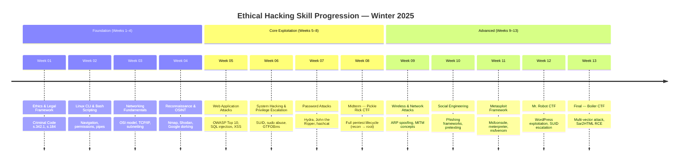
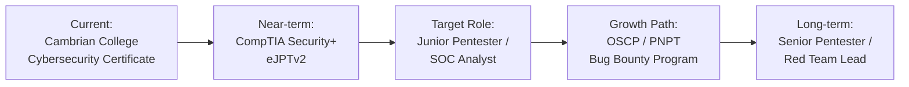

# Ethical Hacking Portfolio — CSC-7311

> Postgraduate Cybersecurity Certificate · Cambrian College · Winter 2025
> Instructor: **Jeff Caldwell** · Course Code: **CSC-7311-11825**

[](https://github.com/RossMora-Pilots/Ethical-Hacking-CSC-7311/actions/workflows/markdownlint.yml)
[](https://github.com/RossMora-Pilots/Ethical-Hacking-CSC-7311/actions/workflows/gitleaks.yml)

A public, employer-facing portfolio documenting a 13-week offensive security course: methodology, reconnaissance, enumeration, exploitation, post-exploitation, and reporting. All offensive work targeted intentionally vulnerable lab environments on TryHackMe; nothing here was aimed at production infrastructure.

---

## Quick Start for Hiring Managers

**If you have 5 minutes:**

- Skim [Key Achievements](#key-achievements) below
- Open the [Boiler CTF Final Exam walkthrough](CC/Winter%202025/Ethical%20Hacking%20-%20Jeff%20Caldwell%20-%20CSC-7311-11825/ctf-walkthroughs/final-boiler-ctf.md)
- Check the [Tools & Techniques](#tools--techniques-mastered) section

**If you have 15 minutes:**

- Read the full course [README](CC/Winter%202025/Ethical%20Hacking%20-%20Jeff%20Caldwell%20-%20CSC-7311-11825/README.md)
- Review the [Midterm: Pickle Rick CTF](CC/Winter%202025/Ethical%20Hacking%20-%20Jeff%20Caldwell%20-%20CSC-7311-11825/ctf-walkthroughs/midterm-pickle-rick.md)
- Read the [OWASP Top 10 reference](CC/Winter%202025/Ethical%20Hacking%20-%20Jeff%20Caldwell%20-%20CSC-7311-11825/references/owasp-top-10.md)

**If you have 30 minutes:**

- Walk the weekly reports chronologically ([weekly-reports/](CC/Winter%202025/Ethical%20Hacking%20-%20Jeff%20Caldwell%20-%20CSC-7311-11825/weekly-reports/))
- Review both CTF walkthroughs (Pickle Rick + Boiler) and compare approaches
- Read the [methodology](CC/Winter%202025/Ethical%20Hacking%20-%20Jeff%20Caldwell%20-%20CSC-7311-11825/references/methodology.md) primer

---

## Key Achievements

| Dimension | Evidence |
|---|---|
| **CTF rooms completed** | 3 (TryHackMe: Pickle Rick, Mr. Robot, Boiler) |
| **Major writeups published** | 11 weekly reports + 3 CTF walkthroughs + OWASP Top 10 study companion |
| **Tools exercised hands-on** | Nmap, Gobuster, Nikto, curl, OpenVAS, JoomScan, Hydra, Metasploit, GTFOBins, Linux shell primitives |
| **Attack surfaces covered** | Web apps, network services, FTP, SSH, Joomla CMS, WordPress, phishing, wireless, Sar2HTML RCE, SUID privilege escalation |
| **Frameworks studied** | Cyber Kill Chain (Lockheed Martin), MITRE ATT&CK, PTES, OSSTMM, OWASP Top 10 |
| **Legal/ethical grounding** | Canadian Criminal Code computer crime provisions, privacy law, responsible disclosure, NDA scoping |
| **Lab environment** | Kali Linux on VirtualBox + TryHackMe attack/target VMs |

---

## Tools & Techniques Mastered

### Reconnaissance & Enumeration

- **Nmap** — port scanning, service/version detection, default scripts (`-sC -sV -p-`), aggressive scans (`-A`, `-T4`), live host discovery
- **Gobuster** — directory brute-forcing with `dirb/common.txt`, `directory-list-2.3-medium.txt`, extensions `-x php,html,txt`
- **Nikto** — web server vulnerability surface scanning
- **curl** — inspecting `robots.txt`, raw HTTP responses, header analysis
- **Anonymous FTP** — banner grabbing, file retrieval, ROT13 decoding of hidden notes

### Vulnerability Assessment

- **OpenVAS / Greenbone** — authenticated vulnerability scanning
- **JoomScan** — Joomla CMS vulnerability scanning (OWASP project)
- **Sar2HTML RCE (CVE-like)** — command injection via `plot=` parameter

### Exploitation

- **Command injection** via web parameters
- **Credential discovery** in HTML comments, `robots.txt`, log files, shell scripts
- **Web portal authentication bypass & abuse** (Pickle Rick)
- **Shell upgrades** (reverse shells → interactive PTY via `python -c 'import pty'`)

### Privilege Escalation

- **sudo -l** enumeration
- **SUID binary abuse** via GTFOBins (notably `/usr/bin/find` on Boiler CTF)
- **Sensitive file discovery** (`.secret`, `backup.sh`, shell scripts leaking credentials)

### Social Engineering & Physical

- **Phishing analysis** (indicators: sender spoofing, header anomalies, payload crafting)
- **Wireless reconnaissance** — Wi-Fi Pineapple demo, rogue AP concepts
- **RF / sub-GHz** — Flipper Zero demo, RFID/NFC cloning concepts

---

## Repository Navigation

```text
409-Ethical-Hacking/
├── README.md                                    ← you are here
├── ROADMAP.md                                   ← project tracking
├── AGENTS.md                                    ← agent onboarding & safety
├── CONTRIBUTING.md                              ← PM conventions
├── CC/                                          ← academic course materials
│   └── Winter 2025/
│       └── Ethical Hacking - Jeff Caldwell - CSC-7311-11825/
│           ├── README.md                        ← course-level entry point
│           ├── weekly-reports/                  ← one report per week (1-13)
│           ├── ctf-walkthroughs/                ← full walkthroughs (Pickle Rick, Mr Robot, Boiler)
│           ├── references/                      ← OWASP, methodology, tools, legal framework
│           ├── assignments/                     ← sanitized submissions (original sources redacted)
│           ├── screenshots/                     ← evidence images (wkNN_topic_index.png)
│           ├── scripts/                         ← student-authored automation
│           ├── scripts-extra/                   ← provided / external references
│           ├── EVIDENCE_INDEX.md                ← auto-generated screenshot index
│           └── SCRIPTS_README.md                ← auto-generated script index
├── docs/                                        ← repository documentation
├── portfolio/
│   └── config.json                              ← course metadata & metrics
├── scripts/                                     ← automation (PM loop, roadmap parsing)
├── templates/                                   ← reusable writeup templates
└── artifacts/                                   ← generated JSON/state files (CI-produced)
```

---

## Course Topics Covered (14 Weeks)

| Week | Topic | Deliverable |
|---|---|---|
| 1 | Course orientation, legal/ethical framework, methodology overview, lab setup | Kali + VirtualBox + TryHackMe account ready |
| 2 | Network protocol refresher, footprinting, social engineering concepts | Discussion + reading |
| 3 | **Cyber Kill Chain** (Parts 1 & 2) — Lockheed Martin model + MITRE ATT&CK | Written assignment |
| 4 | Nmap deep dive, OSI model review, recon, web app security intro (Module 03) | Lab 3 walkthrough |
| 5 | Enumeration, brute-force attacks, **OpenVAS** vulnerability scanning | Lab walkthrough |
| 6 | Network services exploitation (Parts 1-2-3) | Lab walkthrough |
| 7 | Reading week / consolidation | — |
| 8 | **MIDTERM — TryHackMe Pickle Rick** (web exploitation CTF) | Full walkthrough |
| 9 | Review / catch-up | — |
| 10 | **Phishing Analysis** (Part 1) + Phishing in Action (Part 2) | Lab walkthrough |
| 11 | Live host discovery (Nmap) + **Wireless Hacking 101** | Dual lab walkthrough |
| 12 | **Mr. Robot CTF** — WordPress enumeration & exploitation | Lab walkthrough |
| 13 | **FINAL — TryHackMe Boiler CTF** + OWASP Top 10 review | Full walkthrough |

---

## Methodology Followed

All labs and CTFs followed the penetration-testing lifecycle emphasized throughout the course:

1. **Reconnaissance & footprinting** — gather information via open-source methods
2. **Scanning & enumeration** — identify accessible systems, services, versions
3. **Gaining access** — exploit identified vulnerabilities
4. **Maintaining access** — persistence mechanisms (scoped to lab targets)
5. **Covering tracks** — understood in concept; not practiced destructively
6. **Reporting** — every step documented with tool, purpose, expected vs. actual outcome, and screenshot evidence

This mirrors the [Cyber Kill Chain](CC/Winter%202025/Ethical%20Hacking%20-%20Jeff%20Caldwell%20-%20CSC-7311-11825/references/cyber-kill-chain.md) and maps cleanly to [MITRE ATT&CK](https://attack.mitre.org/) tactics.

---

## Ethical & Legal Boundary

> "You do it legally. Otherwise, you're just a hacker and you're going to jail for that kind of thing." — J. Caldwell, Week 1

Every technique demonstrated in this portfolio was executed against **intentionally vulnerable, published lab targets** (TryHackMe CTF rooms). No action was taken against any production system, third-party infrastructure, or individual without authorization. Course content explicitly covered:

- **Canadian Criminal Code** computer crime provisions (s. 342.1, s. 430(1.1))
- **Canadian privacy law** (PIPEDA)
- **Responsible disclosure** workflows and bug bounty programs
- **Scope management** via written NDAs and contracts
- **Authorized / unauthorized / semi-authorized** hacker classifications (replacing white/grey/black hat terminology)

See [references/legal-and-ethics.md](CC/Winter%202025/Ethical%20Hacking%20-%20Jeff%20Caldwell%20-%20CSC-7311-11825/references/legal-and-ethics.md) for the full treatment.

---

## Skill Progression

A week-by-week view of offensive security skills developed throughout this course:



> [!NOTE]
> Each week built on the previous, culminating in two full-lifecycle CTF assessments that required combining reconnaissance, exploitation, privilege escalation, and reporting skills.

---

## About the Author

**Ross Moravec** · Postgraduate Cybersecurity Certificate candidate, Cambrian College (Sudbury, Ontario). Background spans software development, IT business analysis, project planning, and systems administration. This portfolio is one of a series of course repositories documenting the Fall 2024 – Winter 2025 program.

**Seeking:** a junior penetration tester, SOC analyst, or application security role where I can apply offensive security methodology to defend enterprise systems.

📫 **Contact:** [LinkedIn](https://www.linkedin.com/in/ross-moravec/) · [GitHub](https://github.com/RossMora)

Companion portfolios:

- [010 — Intro to Cybersecurity (CSC-7301)](../010-Intro-To-Cybersecurity-Csc-7301-Fall-2024-Instructor-Maryam-Ahmed)
- [008 — Cybersecurity Network Defense](../008-Cybersecurity-Network-Defense-Portfolio)
- [009 — Course Repository Template & Guidelines](../009-Course-Repository-Template-and-Guidelines)

---

## What's Next



**Immediate goals (2025):**

- Complete the Postgraduate Cybersecurity Certificate (in progress)
- Earn CompTIA Security+ certification
- Continue building TryHackMe portfolio (current focus: Active Directory rooms)

**12-month targets:**

- Pursue eLearnSecurity Junior Penetration Tester (eJPTv2) or TCM PNPT certification
- Contribute to open-source security tooling
- Begin responsible disclosure / bug bounty participation (HackerOne, Bugcrowd)

---

## License & Attribution

Coursework authored by Ross Moravec under the academic supervision of Prof. Jeff Caldwell at Cambrian College. TryHackMe room credits remain with TryHackMe and the individual room creators. This repository is published for educational and portfolio purposes; reproduce walkthrough content with attribution.
